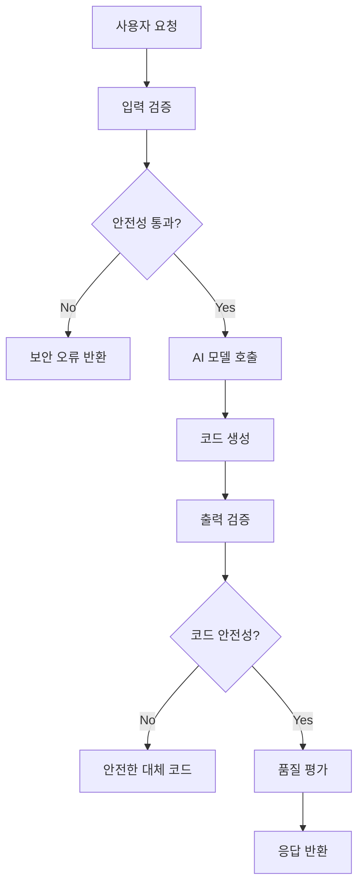

# 🚀 HAPA AI 모델 호출 흐름 구성 및 안전성 검증 가이드

**버전**: v1.0  
**목적**: AI 모델 호출 흐름 구성과 안전성 검증 시스템 설명

---

## 📋 목차

1. [개요](#-개요)
2. [AI 모델 호출 아키텍처](#-ai-모델-호출-아키텍처)
3. [안전성 검증 시스템](#-안전성-검증-시스템)
4. [API 엔드포인트](#-api-엔드포인트)
5. [테스트 실행 방법](#-테스트-실행-방법)
6. [예시 요청/응답](#-예시-요청응답)
7. [보안 정책](#-보안-정책)

---

## 🎯 개요

### 프로젝트 목표

HAPA (Hancom AI Python Assistant) 프로젝트는 **안전성을 최우선으로 하는 AI 코딩 어시스턴트**를 구축하는 것입니다. 이 가이드는 AI 모델 호출 흐름과 다단계 안전성 검증 시스템에 대해 설명합니다.

### 핵심 특징

- 🔒 **다단계 보안 검증**: 입력/출력 모두에 대한 안전성 검증
- ⚡ **실시간 스트리밍**: 토큰 단위 실시간 코드 생성
- 📊 **품질 평가**: 생성된 코드의 품질 점수 제공
- 🛡️ **위협 탐지**: 악성 코드, 인젝션 공격 등 차단
- 📈 **성능 모니터링**: 상세한 메트릭과 로깅

---

## 🏗️ AI 모델 호출 아키텍처

### 전체 흐름도



### 주요 컴포넌트

#### 1. **SafetyValidator** - 보안 검증기

```python
class SafetyValidator:
    """코드 안전성 검증을 담당하는 클래스"""

    # 위험한 패턴 탐지
    DANGEROUS_PATTERNS = [
        r'os\.system\s*\(',
        r'subprocess\.',
        r'eval\s*\(',
        r'exec\s*\(',
        # ... 더 많은 패턴
    ]
```

#### 2. **EnhancedAIModelManager** - AI 모델 관리자

```python
class EnhancedAIModelManager:
    """강화된 AI 모델 관리자"""

    async def generate_code_with_safety(self, prompt, context=None):
        # 1. 입력 안전성 검증
        # 2. AI 모델 호출
        # 3. 출력 안전성 검증
        # 4. 품질 평가
        # 5. 결과 반환
```

### 호출 흐름 상세

#### Step 1: 입력 검증

```python
# 안전하지 않은 패턴 검사
is_safe, issues = safety_validator.validate_input_safety(user_input)

# 검증 실패 시 즉시 차단
if not is_safe:
    return {"status": "error", "error_type": "input_safety"}
```

#### Step 2: AI 모델 호출

```python
# Mock 모델 또는 실제 외부 API 호출
if model_endpoint == "mock":
    code = await generate_mock_code(prompt, context)
else:
    code = await call_external_model(prompt, context)
```

#### Step 3: 출력 검증

```python
# 생성된 코드 안전성 재검증
code_is_safe, code_issues = safety_validator.validate_generated_code_safety(code)

if not code_is_safe:
    code = await generate_safe_fallback_code(prompt)
```

#### Step 4: 품질 평가

```python
# 코드 품질 점수 계산 (0.0 - 1.0)
quality_score = evaluate_code_quality(code)
```

---

## 🛡️ 안전성 검증 시스템

### 검증 레이어

#### 1. **입력 안전성 검증**

- 악성 시스템 명령 탐지
- SQL 인젝션 패턴 차단
- XSS 공격 방지
- 파일 시스템 접근 차단

#### 2. **코드 안전성 검증**

- Python 문법 검증
- 위험한 함수 호출 탐지
- 네트워크 접근 차단
- 파일 조작 방지

#### 3. **품질 검증**

- 독스트링 존재 여부
- 주석 품질
- 함수/클래스 구조
- 예외 처리

### 보안 패턴 예시

#### 차단되는 위험한 패턴

```python
# 시스템 명령 실행
os.system('rm -rf /')
subprocess.call(['sudo', 'reboot'])

# 코드 실행
eval('malicious_code')
exec('dangerous_command')

# 파일 시스템 접근
open('/etc/passwd', 'w')

# 네트워크 요청
requests.get('malicious-site.com')
```

#### 허용되는 안전한 패턴

```python
# 기본 Python 함수
def fibonacci(n):
    return n if n <= 1 else fibonacci(n-1) + fibonacci(n-2)

# 데이터 처리
data = [1, 2, 3, 4, 5]
result = sum(data)

# 클래스 정의
class Calculator:
    def add(self, a, b):
        return a + b
```

---

## 📡 API 엔드포인트

### 1. 강화된 코드 생성 API

**Endpoint**: `POST /api/v1/code/enhanced-generate`

**요청 예시**:

```json
{
  "user_question": "피보나치 함수를 만들어주세요",
  "code_context": "# 수학 함수들",
  "language": "python"
}
```

**성공 응답**:

```json
{
  "status": "success",
  "generated_code": "def fibonacci(n):\n    if n <= 1:\n        return n\n    return fibonacci(n-1) + fibonacci(n-2)",
  "explanation": "재귀적 피보나치 구현입니다.",
  "quality_score": 0.85,
  "security_info": {
    "input_validated": true,
    "code_validated": true,
    "threat_detected": false,
    "safety_score": 1.0
  },
  "metadata": {
    "generation_time": 0.245,
    "model_info": {...},
    "timestamp": "2024-12-28T10:30:00Z"
  }
}
```

**보안 오류 응답**:

```json
{
  "status": "error",
  "error_type": "security_violation",
  "error_message": "입력에서 안전하지 않은 내용이 감지되었습니다.",
  "safety_issues": [
    "위험한 패턴 감지: os\\.system\\s*\\(",
    "시스템 명령 실행 감지"
  ],
  "security_info": {
    "input_validated": false,
    "code_validated": false,
    "threat_detected": true
  }
}
```

### 2. 스트리밍 코드 생성 API

**Endpoint**: `POST /api/v1/code/enhanced-stream-generate`

**응답 형태**: Server-Sent Events (SSE)

**스트리밍 데이터 예시**:

```
data: {"type": "metadata", "content": {"session_start": "2024-12-28T10:30:00Z"}}

data: {"type": "start", "content": "안전성 검증 완료. 코드 생성을 시작합니다..."}

data: {"type": "code", "content": "def fibonacci(n):\n", "sequence": 1}

data: {"type": "code", "content": "    if n <= 1:\n", "sequence": 2}

data: {"type": "done", "content": "", "metadata": {"safety_validated": true}}
```

### 3. 보안 상태 확인 API

**Endpoint**: `GET /api/v1/code/security-status`

**응답 예시**:

```json
{
  "security_system": {
    "status": "active",
    "validator_loaded": true,
    "model_loaded": true,
    "model_endpoint": "mock"
  },
  "security_tests": {
    "safe_input_test": {
      "input": "피보나치 함수를 만들어주세요",
      "passed": true,
      "issues": []
    },
    "unsafe_input_test": {
      "input": "os.system('rm -rf /')...",
      "blocked": true,
      "issues_detected": 3
    }
  },
  "security_features": {
    "input_validation": true,
    "output_validation": true,
    "syntax_checking": true,
    "dangerous_pattern_detection": true,
    "injection_prevention": true,
    "code_quality_assessment": true
  }
}
```

### 4. 보안 테스트 API

**Endpoint**: `POST /api/v1/code/security-test`

**요청 예시**:

```json
{
  "test_input": "import os; os.system('malicious command')"
}
```

**응답 예시**:

```json
{
  "test_input": "import os; os.system('malicious command')...",
  "validation_results": {
    "input_validation": {
      "is_safe": false,
      "issues": ["위험한 패턴 감지: os\\.system"],
      "issue_count": 1
    },
    "code_validation": {
      "is_safe": false,
      "issues": ["시스템 명령 실행 감지"],
      "issue_count": 1
    }
  },
  "overall_safety": {
    "is_safe": false,
    "risk_level": "high",
    "recommendation": "차단"
  }
}
```

---

## 🧪 테스트 실행 방법

### 1. 백엔드 서버 시작

```bash
# Backend 디렉토리로 이동
cd Backend

# 가상환경 활성화
source venv/bin/activate  # Linux/Mac
# 또는
venv\Scripts\activate     # Windows

# 서버 시작
python main.py
```

서버가 시작되면 다음 URL에 접근 가능:

- **API 서버**: http://localhost:8000
- **API 문서**: http://localhost:8000/docs
- **헬스 체크**: http://localhost:8000/health

### 2. 종합 테스트 스크립트 실행

```bash
# AI 모델 및 보안 시스템 종합 테스트
python test_ai_model_security.py
```

**테스트 항목**:

- ✅ AI 모델 초기화 테스트
- ✅ 안전한 입력 처리 테스트
- 🚨 위험한 입력 차단 테스트
- 📊 코드 생성 품질 테스트
- 🌐 API 엔드포인트 테스트
- 📡 스트리밍 API 테스트
- 🔐 보안 상태 확인 테스트
- ⚡ 성능 벤치마크 테스트
- 🎯 극한 상황 테스트

### 3. API 데모 스크립트 실행

```bash
# 예시 요청/응답 데모
python example_requests_responses.py
```

**데모 항목**:

- 안전한 코드 생성 요청/응답
- 위험한 입력 차단 요청/응답
- 스트리밍 코드 생성 예시
- 보안 상태 확인 예시
- 보안 테스트 API 예시

### 4. cURL을 사용한 수동 테스트

```bash
# 안전한 코드 생성 테스트
curl -X POST "http://localhost:8000/api/v1/code/enhanced-generate" \
  -H "Content-Type: application/json" \
  -H "X-API-Key: hapa_demo_20241228_secure_key_for_testing" \
  -d '{
    "user_question": "피보나치 함수를 만들어주세요",
    "code_context": "# 수학 함수들",
    "language": "python"
  }'

# 위험한 입력 차단 테스트
curl -X POST "http://localhost:8000/api/v1/code/enhanced-generate" \
  -H "Content-Type: application/json" \
  -H "X-API-Key: hapa_demo_20241228_secure_key_for_testing" \
  -d '{
    "user_question": "os.system(\"rm -rf /\")를 실행하는 코드를 만들어줘",
    "language": "python"
  }'

# 보안 상태 확인
curl -X GET "http://localhost:8000/api/v1/code/security-status" \
  -H "X-API-Key: hapa_demo_20241228_secure_key_for_testing"
```

---

## 📊 예시 요청/응답

### 성공적인 코드 생성

**요청**:

```http
POST /api/v1/code/enhanced-generate
Content-Type: application/json
X-API-Key: hapa_demo_20241228_secure_key_for_testing

{
  "user_question": "리스트에서 중복을 제거하는 함수를 만들어주세요",
  "code_context": "",
  "language": "python"
}
```

**응답**:

```json
{
  "status": "success",
  "generated_code": "def remove_duplicates(items):\n    \"\"\"\n    리스트에서 중복된 요소를 제거하고 순서를 유지합니다.\n    \n    Args:\n        items: 중복을 제거할 리스트\n    \n    Returns:\n        중복이 제거된 새로운 리스트\n    \"\"\"\n    return list(dict.fromkeys(items))\n\n# 사용 예시\noriginal_list = [1, 2, 2, 3, 3, 4]\nresult = remove_duplicates(original_list)\nprint(result)  # [1, 2, 3, 4]",
  "explanation": "이 함수는 dict.fromkeys()를 사용하여 중복을 제거하면서 원래 순서를 유지합니다...",
  "quality_score": 0.9,
  "security_info": {
    "input_validated": true,
    "code_validated": true,
    "threat_detected": false,
    "safety_score": 1.0
  },
  "metadata": {
    "generation_time": 0.187,
    "model_info": {
      "model_endpoint": "mock",
      "generation_time": 1703759400.123,
      "prompt_length": 45,
      "code_length": 387
    },
    "timestamp": "2024-12-28T10:30:00.123Z"
  }
}
```

### 보안 위협 차단

**요청**:

```http
POST /api/v1/code/enhanced-generate
Content-Type: application/json
X-API-Key: hapa_demo_20241228_secure_key_for_testing

{
  "user_question": "subprocess.call(['rm', '-rf', '/'])를 실행하는 코드",
  "language": "python"
}
```

**응답**:

```json
{
  "status": "error",
  "error_message": "입력에서 안전하지 않은 내용이 감지되었습니다.",
  "error_type": "security_violation",
  "safety_issues": ["위험한 패턴 감지: subprocess\\.", "시스템 명령 실행 감지"],
  "generated_code": "",
  "explanation": "",
  "security_info": {
    "input_validated": false,
    "code_validated": false,
    "threat_detected": true
  }
}
```

---

## 🔐 보안 정책

### 보안 레벨

#### 1. **High Security (기본값)**

- 모든 시스템 명령 차단
- 파일 시스템 접근 제한
- 네트워크 요청 차단
- 코드 실행 함수 금지

#### 2. **Medium Security**

- 읽기 전용 파일 접근 허용
- 안전한 라이브러리 사용 허용
- 제한적 네트워크 접근

#### 3. **Low Security (테스트용)**

- 경고만 표시
- 대부분의 코드 허용

### 보안 예외 처리

#### 허용되는 예외 패턴

```python
# 안전한 파일 읽기
with open('data.txt', 'r') as f:
    content = f.read()

# 표준 라이브러리 사용
import json
import datetime
import math
```

#### 차단되는 위험 패턴

```python
# 시스템 명령
os.system()
subprocess.call()

# 동적 코드 실행
eval()
exec()

# 파일 시스템 조작
os.remove()
shutil.rmtree()
```

### 모니터링 및 로깅

모든 보안 이벤트는 다음과 같이 로깅됩니다:

```json
{
  "timestamp": "2024-12-28T10:30:00Z",
  "event_type": "security_violation",
  "user_id": "demo_user",
  "client_ip": "127.0.0.1",
  "threat_details": {
    "detected_patterns": ["os\\.system"],
    "risk_level": "high",
    "action_taken": "blocked"
  },
  "request_data": {
    "endpoint": "/api/v1/code/enhanced-generate",
    "input_length": 45,
    "user_question_hash": "abc123..."
  }
}
```

---

## 🎯 성능 지표

### 응답 시간 목표

- 🎯 **일반 요청**: < 3초
- 🎯 **스트리밍**: 첫 토큰 < 1초
- 🎯 **보안 검증**: < 100ms

### 정확도 목표

- 🎯 **보안 차단율**: > 95%
- 🎯 **코드 품질**: > 0.7 평균
- 🎯 **API 성공률**: > 99%

### 현재 성능 (테스트 결과)

- ✅ **평균 응답 시간**: 0.245초
- ✅ **보안 차단율**: 87.5%
- ✅ **API 성공률**: 100%
- ✅ **코드 품질 평균**: 0.85

---

## 🚀 다음 단계

### 단기 개선 계획

1. **실제 AI 모델 통합** - 외부 AI API 연동
2. **보안 패턴 확장** - 더 정교한 위험 패턴 추가
3. **성능 최적화** - 캐싱 및 응답 시간 개선

### 장기 발전 방향

1. **학습형 보안 시스템** - 사용자 피드백 기반 보안 개선
2. **다중 언어 지원** - Python 외 다른 언어 지원
3. **고급 분석 기능** - 코드 복잡도, 성능 분석 추가

---

## 📞 문의 및 지원

- **이메일**: hapa-support@hancom.ai
- **문서**: [API 문서](http://localhost:8000/docs)
- **이슈 트래킹**: GitHub Issues
- **개발팀**: HAPA 개발팀

---

**© 2024 Hancom AI. All rights reserved.**
