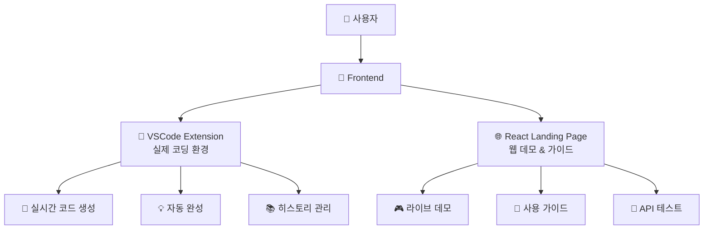

# 🎨 HAPA Frontend

> **사용자와 만나는 최전선 인터페이스**  
> VSCode Extension + React Landing Page로 완벽한 AI 코딩 경험 제공

## 🤔 **Frontend가 하는 일**

**간단히 설명하면**: 사용자가 AI 코딩 어시스턴트를 편리하게 사용할 수 있는 화면과 기능을 제공합니다! ✨



## 🌟 **두 가지 Frontend**

### **📝 1. VSCode Extension (메인 인터페이스)**
> **개발자가 실제로 코딩할 때 사용하는 핵심 도구**

**주요 기능:**
- **🤖 실시간 AI 코드 생성**: 주석만 써도 자동으로 코드 완성
- **💡 스마트 자동완성**: 컨텍스트 기반 지능형 제안
- **📚 히스토리 관리**: 과거 질문-답변 저장 및 재사용
- **⚙️ 개인화 설정**: 스킬 레벨별 맞춤 코드 생성
- **🎯 멀티 에이전트**: 웹 개발자, 데이터 사이언티스트 등 역할별 AI

### **🌐 2. React Landing Page (데모 & 가이드)**
> **HAPA를 처음 접하는 사람들을 위한 웹 인터페이스**

**주요 기능:**
- **🎮 라이브 데모**: 웹에서 바로 AI 코드 생성 체험
- **📖 사용 가이드**: 설치부터 고급 사용법까지
- **🔗 API 테스트**: REST API 실시간 테스트
- **📊 상태 모니터링**: 백엔드 서버 상태 실시간 확인

## 📁 **프로젝트 구조**
Frontend/
├── vscode-extension/ # 🎯 메인 Extension
│ ├── src/
│ │ ├── providers/ # 5개 핵심 Provider
│ │ │ ├── SidebarProvider.ts # 메인 AI 인터페이스
│ │ │ ├── OnboardingProvider.ts # 온보딩 가이드
│ │ │ ├── SettingsProvider.ts # 개인화 설정
│ │ │ ├── GuideProvider.ts # 사용법 가이드
│ │ │ └── BaseWebviewProvider.ts # 공통 기능
│ │ ├── services/ # 12개 전문 서비스
│ │ ├── modules/ # 6개 핵심 모듈
│ │ ├── core/ # 5개 핵심 시스템
│ │ └── templates/ # UI 템플릿 & 스타일
│ ├── package.json # Extension 설정
│ └── README.md # Extension 가이드


## 🚀 **빠른 시작**

### **📝 VSCode Extension 개발**

```bash
# 1. Extension 개발 환경 설정
cd Frontend/vscode-extension
npm install

# 2. TypeScript 컴파일
npm run compile

# 3. Extension 테스트
# VSCode에서 F5 키 → Extension Development Host 실행

# 4. 사용 방법
# Python 파일에서 다음 주석 입력:
# 파이썬 리스트 정렬하는 함수 만들어줘
# → 자동으로 코드 생성!
```

### **🌐 React Landing Page 개발**

```bash
# 1. 웹앱 개발 환경 설정
cd Frontend/landing-page
npm install

# 2. 개발 서버 시작
npm start
# → http://localhost:3000에서 확인

# 3. 프로덕션 빌드
npm run build
```

### **🐳 Docker로 전체 실행**

```bash
# 전체 Frontend 서비스 시작
docker-compose up frontend

# 또는 개별 실행
docker-compose up landing-page
```

## 💻 **VSCode Extension 상세**

### **🎯 핵심 Provider 시스템**

#### **1. SidebarProvider** (메인 AI 인터페이스)
```typescript
// 실시간 AI 코드 생성 인터페이스
class SidebarProvider {
  // 🤖 AI 질문-답변 처리
  async handleAIQuestion(question: string)
  
  // 🌊 실시간 스트리밍 코드 생성
  async handleStreamingCodeGeneration(question: string)
  
  // 📚 히스토리 관리 (MongoDB 연동)
  async loadHistoryFromDB()
  async saveHistoryToDB()
  
  // 🎯 멀티 에이전트 지원
  selectModel(modelType: string)
}
```

#### **2. OnboardingProvider** (온보딩 시스템)
```typescript
// 6단계 온보딩 프로세스
class OnboardingProvider {
  // 📧 이메일 입력 → 🎯 스킬 레벨 → ⚙️ 설정 → ✅ 완료
  handleNextStep(stepData: any)
  
  // 🔗 자동 DB 연동 및 설정 저장
  async saveUserProfileToDB()
}
```

### **🔧 주요 기능**

#### **🤖 AI 코드 생성**
```javascript
// 사용자가 주석 입력
// 데이터베이스 연결 함수 만들어줘

// ↓ AI가 자동 생성
import sqlite3

def connect_database(db_path="database.db"):
    """데이터베이스에 연결하는 함수"""
    try:
        conn = sqlite3.connect(db_path)
        return conn
    except sqlite3.Error as e:
        print(f"데이터베이스 연결 오류: {e}")
        return None
```

#### **📚 히스토리 관리**
- **MongoDB 연동**: 모든 질문-답변 영구 저장
- **빠른 검색**: 과거 대화 내용 실시간 검색
- **재사용 기능**: 클릭 한 번으로 이전 답변 재사용

#### **⚙️ 개인화 설정**
- **스킬 레벨**: 초급자 → 상세 설명, 전문가 → 간결한 코드
- **코딩 스타일**: 최소화, 표준, 상세, 포괄적
- **설명 방식**: 간단, 표준, 상세, 교육용

### **🎨 UI/UX 특징**

#### **VSCode 네이티브 스타일**
```css
/* VSCode 테마 완벽 적용 */
.vscode-sidebar-container {
  background: var(--vscode-sidebar-background);
  color: var(--vscode-sidebar-foreground);
  border: 1px solid var(--vscode-sidebar-border);
}

/* 다크/라이트 테마 자동 전환 */
.vscode-btn-primary {
  background: var(--vscode-button-background);
  color: var(--vscode-button-foreground);
}
```

#### **반응형 디자인**
- **사이드바 모드**: 일반적인 개발 시 사용
- **확장 모드**: 큰 화면에서 상세 작업
- **자동 크기 조절**: 화면 크기에 맞춰 UI 자동 최적화

## 🌐 **React Landing Page 상세**

### **🎮 라이브 데모 시스템**

#### **ThunderDemo Component**
```typescript
// 실시간 AI 코드 생성 체험
const ThunderDemo: React.FC = () => {
  const [input, setInput] = useState("");
  const [output, setOutput] = useState("");
  const [isStreaming, setIsStreaming] = useState(false);
  
  // 🌊 Server-Sent Events로 실시간 스트리밍
  const handleSend = async () => {
    const response = await fetch('/api/v1/code/generate/stream', {
      method: 'POST',
      headers: { 'Content-Type': 'application/json' },
      body: JSON.stringify({ user_question: input })
    });
    
    // 실시간으로 코드 생성 과정 표시
    const reader = response.body?.getReader();
    // ...
  };
};
```

### **📊 API 상태 모니터링**

#### **ApiStatus Component**
```typescript
// 백엔드 서버 실시간 상태 체크
const ApiStatus: React.FC = () => {
  const [status, setStatus] = useState<"connected" | "disconnected">("checking");
  
  const checkApiHealth = async () => {
    const startTime = Date.now();
    const response = await fetch('http://3.13.240.111:8000/api/v1/health');
    const responseTime = Date.now() - startTime;
    
    setStatus(response.ok ? "connected" : "disconnected");
  };
  
  // 30초마다 자동 상태 체크
  useEffect(() => {
    const interval = setInterval(checkApiHealth, 30000);
    return () => clearInterval(interval);
  }, []);
};
```

### **🎨 UI 컴포넌트 시스템**

#### **주요 컴포넌트**
- **ThunderButton**: VSCode 스타일 버튼
- **ThunderCard**: 정보 카드 컴포넌트  
- **LiveDemo**: 실시간 AI 데모
- **ApiStatus**: 서버 상태 표시
- **ToastNotification**: 알림 시스템

#### **접근성 지원**
```typescript
// 스크린 리더, 키보드 내비게이션 등 완벽 지원
export const useAccessibility = () => {
  const [screenReader, setScreenReader] = useState(false);
  const [keyboardNavigation, setKeyboardNavigation] = useState(false);
  const [highContrast, setHighContrast] = useState(false);
  
  // 접근성 기능 자동 감지 및 적용
};
```

## 🛠️ **개발 도구 & 설정**

### **VSCode Extension**

#### **package.json 주요 설정**
```json
{
  "name": "hapa-ai-assistant",
  "displayName": "HAPA AI Python Assistant",
  "version": "1.0.0",
  "engines": { "vscode": "^1.82.0" },
  "categories": ["Other", "Snippets", "Machine Learning"],
  "activationEvents": ["onLanguage:python"],
  "contributes": {
    "views": {
      "explorer": [
        {
          "id": "hapa-sidebar",
          "name": "HAPA AI Assistant",
          "when": "true"
        }
      ]
    },
    "commands": [
      {
        "command": "hapa.showSidebar",
        "title": "Show HAPA Assistant"
      }
    ]
  }
}
```

#### **TypeScript 설정**
```json
// tsconfig.json
{
  "compilerOptions": {
    "target": "ES2020",
    "module": "commonjs",
    "lib": ["ES2020"],
    "outDir": "out",
    "rootDir": "src",
    "strict": true,
    "esModuleInterop": true
  }
}
```

### **React Landing Page**

#### **주요 의존성**
```json
{
  "dependencies": {
    "react": "^18.2.0",
    "typescript": "^5.0.0",
    "tailwindcss": "^3.3.0",
    "@types/react": "^18.2.0"
  },
  "scripts": {
    "start": "react-scripts start",
    "build": "react-scripts build",
    "test": "react-scripts test"
  }
}
```

#### **Tailwind CSS 설정**
```javascript
// tailwind.config.js
module.exports = {
  content: ["./src/**/*.{js,jsx,ts,tsx}"],
  theme: {
    extend: {
      colors: {
        'vscode-bg': 'var(--vscode-editor-background)',
        'vscode-fg': 'var(--vscode-editor-foreground)',
      }
    }
  }
}
```

## 🔧 **환경 설정**

### **개발 환경 변수**
```bash
# VSCode Extension
VSCODE_HAPA_API_URL=http://localhost:8000/api/v1
VSCODE_HAPA_DB_MODULE_URL=http://localhost:8001

# React Landing Page  
REACT_APP_API_BASE_URL=http://3.13.240.111:8000/api/v1
REACT_APP_DEMO_MODE=true
REACT_APP_ANALYTICS_ENABLED=false
```

### **프로덕션 설정**
```bash
# 운영 환경
REACT_APP_API_BASE_URL=http://3.13.240.111:8000/api/v1
REACT_APP_DEMO_MODE=false
REACT_APP_ANALYTICS_ENABLED=true
```

## 📊 **성능 최적화**

### **VSCode Extension**
- **레이지 로딩**: 필요할 때만 Provider 활성화
- **메모리 관리**: 사용하지 않는 웹뷰 자동 해제
- **캐시 시스템**: 자주 사용하는 응답 로컬 캐시


## 🧪 **테스트**

### **Extension 테스트**
```bash
# 단위 테스트
npm test

# E2E 테스트
npm run test:e2e

# Extension 수동 테스트
# F5 → Extension Development Host → Python 파일에서 테스트
```

### **React 테스트**
```bash
# 컴포넌트 테스트
npm test

# 시각적 회귀 테스트
npm run test:visual

# 접근성 테스트
npm run test:a11y
```

## 🔗 **API 연동**

### **Backend API 호출**
```typescript
// Extension에서 Backend API 호출
class ApiClient {
  async generateCode(question: string): Promise<CodeResponse> {
    const response = await fetch(`${this.baseURL}/code/generate`, {
      method: 'POST',
      headers: {
        'Content-Type': 'application/json',
        'X-API-Key': this.apiKey
      },
      body: JSON.stringify({ user_question: question })
    });
    
    return response.json();
  }
  
  // 🌊 스트리밍 응답 처리
  async generateCodeStream(question: string): Promise<ReadableStream> {
    const response = await fetch(`${this.baseURL}/code/generate/stream`, {
      method: 'POST',
      headers: {
        'Content-Type': 'application/json',
        'X-API-Key': this.apiKey
      },
      body: JSON.stringify({ user_question: question })
    });
    
    return response.body!;
  }
}
```

### **DB-Module 연동**
```typescript
// 사용자 인증 및 설정 관리
class DbModuleClient {
  async login(email: string): Promise<AuthResponse> {
    const response = await fetch(`${this.dbModuleURL}/auth/login`, {
      method: 'POST',
      headers: { 'Content-Type': 'application/json' },
      body: JSON.stringify({ email, username: email.split('@')[0] })
    });
    
    return response.json();
  }
  
  async getUserSettings(token: string): Promise<UserSettings> {
    const response = await fetch(`${this.dbModuleURL}/settings/me`, {
      headers: { 'Authorization': `Bearer ${token}` }
    });
    
    return response.json();
  }
}
```

## 🆘 **문제 해결**

### **자주 발생하는 문제**

**Q: Extension이 활성화되지 않음**
```bash
# 해결: Python 파일을 열어야 Extension 활성화
# 또는 Command Palette에서 "HAPA" 검색
```

**Q: API 연결 실패** 
```bash
# 해결: Backend 서버 상태 확인
curl http://localhost:8000/health

# 네트워크 설정 확인
# VSCode Settings → HAPA → API URL 확인
```

**Q: 웹앱이 로드되지 않음**
```bash
# 해결: 의존성 재설치
rm -rf node_modules package-lock.json
npm install
npm start
```

## 📈 **성능 지표**

| 메트릭 | VSCode Extension | React Landing Page |
|--------|------------------|-------------------|
| **번들 크기** | < 2MB | < 1MB |
| **메모리 사용** | < 50MB | < 30MB |
| **초기 로딩** | < 1초 | < 2초 |
| **API 응답** | < 3초 | < 3초 |

---