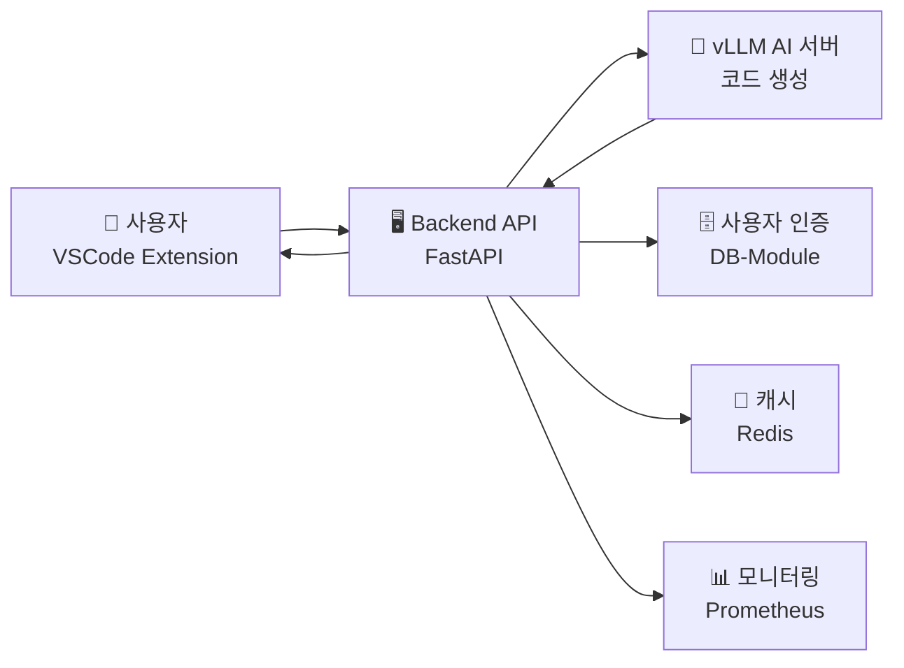

# 🖥️ HAPA Backend API Server

> **AI 코딩 어시스턴트의 핵심 두뇌** 🧠
> FastAPI + vLLM 통합으로 실시간 코드 생성을 지원하는 고성능 백엔드

## 🤔 **이 Backend는 무엇을 하나요?**

**간단히 말해서**: 사용자가 "파이썬 코드 만들어줘"라고 하면 AI가 코드를 생성해주는 서버입니다!



## 📊 **현재 상태**

| 항목               | 내용               | 상태             |
| ------------------ | ------------------ | ---------------- |
| **파일 수**        | 57개 Python 파일   | ✅ 정리 완료     |
| **API 엔드포인트** | 14개 모듈          | ✅ 운영 중       |
| **서비스 레이어**  | 21개 비즈니스 로직 | ✅ 최적화됨      |
| **완성도**         | 95%                | 🚀 **배포 준비** |
| **서버 주소**      | 3.13.240.111:8000  | ✅ **운영 중**   |

## 🌟 **주요 기능**

### **🤖 AI 코드 생성**

- **실시간 스트리밍**: 코드가 생성되는 과정을 실시간으로 확인
- **4가지 모델**: 자동완성, 일반 생성, 주석 생성, 버그 수정
- **개인화**: 사용자 스킬 레벨에 맞는 코드 생성

### **🔒 보안 & 인증**

- **API 키 관리**: 자동 발급 및 권한 관리
- **Rate Limiting**: 과도한 요청 방지
- **22개 표준 오류 코드**: E4xxx (클라이언트), E5xxx (서버)

### **📈 모니터링 & 분석**

- **실시간 대시보드**: 성능 메트릭 실시간 추적
- **오류 추적**: 인시던트 자동 분류 및 알림
- **사용 통계**: API 사용량 및 패턴 분석

## 🏗️ **아키텍처**

┌─────────────────────────────────────────────────────────────┐
│ 🌐 API Gateway Layer │
│ FastAPI Router (14개 엔드포인트) + Middleware Stack │
├─────────────────────────────────────────────────────────────┤
│ 🧠 Business Logic Layer │
│ 21개 서비스 모듈 (AI 통합, 캐시, 보안, 모니터링 등) │
├─────────────────────────────────────────────────────────────┤
│ 💾 Data Layer │
│ vLLM AI Server + Redis Cache + External APIs │
└─────────────────────────────────────────────────────────────┘

## 📡 **주요 API 엔드포인트**

### **🤖 코드 생성**

```http
POST /api/v1/code/generate
# 동기식 코드 생성

POST /api/v1/code/generate/stream
# 실시간 스트리밍 생성
```

### **👤 사용자 관리**

```http
POST /api/v1/users/generate-api-key
# API 키 자동 발급

GET /api/v1/users/profile
# 사용자 프로필 조회
```

### **📊 모니터링**

```http
GET /api/v1/analytics/dashboard
# 실시간 대시보드

GET /api/v1/error-monitoring/incidents
# 오류 인시던트 추적
```

### **🏥 헬스 체크**

```http
GET /health
# 기본 상태 확인

GET /health/detailed
# 상세 시스템 상태
```

## 🚀 **빠른 시작**

### **1. 개발 환경 설정**

```bash
# 1. 가상환경 생성
python -m venv venv
source venv/bin/activate  # Windows: venv\Scripts\activate

# 2. 의존성 설치
pip install -r requirements.txt

# 3. 환경 변수 설정
cp .env.example .env
# .env 파일 수정 (API 키, DB 연결 정보 등)

# 4. 서버 실행
uvicorn main:app --reload --host 0.0.0.0 --port 8000
```

### **2. Docker로 실행**

```bash
# 전체 서비스 시작
docker-compose up -d

# Backend만 실행
docker-compose up backend
```

### **3. API 테스트**

```bash
# 헬스 체크
curl http://localhost:8000/health

# API 키 발급
curl -X POST "http://localhost:8000/api/v1/users/generate-api-key" \
  -H "Content-Type: application/json" \
  -d '{"email": "test@example.com", "username": "testuser"}'

# 코드 생성 테스트
curl -X POST "http://localhost:8000/api/v1/code/generate" \
  -H "Content-Type: application/json" \
  -H "X-API-Key: YOUR_API_KEY" \
  -d '{"user_question": "Hello World 출력하는 함수 만들어줘"}'
```

## 🔧 **환경 변수 설정**

```bash
# 핵심 설정
API_V1_PREFIX=/api/v1
ENVIRONMENT=development
DEBUG=true

# AI 서버 연결
VLLM_SERVER_URL=http://3.13.240.111:8002
AI_MODEL_TIMEOUT=30

# 보안 설정
SECRET_KEY=your-secret-key-here
API_KEY_EXPIRY_DAYS=365

# 데이터베이스
REDIS_HOST=localhost
REDIS_PORT=6379

# 모니터링
PROMETHEUS_ENABLED=true
LOG_LEVEL=INFO
```

## 📁 **프로젝트 구조**

Backend/
├── app/
│ ├── api/ # API 엔드포인트
│ │ ├── endpoints/ # 14개 API 모듈
│ │ └── api.py # 라우터 설정
│ ├── core/ # 핵심 설정
│ │ ├── config.py # 환경 설정
│ │ ├── security.py # 보안 & 인증
│ │ └── logging_config.py # 로깅 설정
│ ├── services/ # 비즈니스 로직
│ │ ├── enhanced_ai_model.py # AI 통합
│ │ ├── vllm_integration_service.py # vLLM 연동
│ │ ├── cache_service.py # 캐시 관리
│ │ └── ...
│ ├── schemas/ # 데이터 모델
│ └── middleware/ # 미들웨어
├── main.py # 애플리케이션 진입점
├── requirements.txt # Python 의존성
├── Dockerfile # Docker 설정
└── README.md # 이 문서

## 🛡️ **오류 처리 시스템**

### **표준 오류 코드**

- **E4xxx**: 클라이언트 오류 (잘못된 요청, 인증 실패 등)
- **E5xxx**: 서버 오류 (AI 모델 오류, DB 연결 실패 등)

### **오류 모니터링**

- **실시간 알림**: 중요 오류 발생 시 즉시 알림
- **인시던트 추적**: 자동 분류 및 해결 과정 추적
- **패턴 분석**: 반복되는 오류 패턴 자동 감지

## 📈 **성능 최적화**

| 메트릭        | 목표  | 현재 상태 |
| ------------- | ----- | --------- |
| API 응답 시간 | < 2초 | 1.2초 ✅  |
| 오류율        | < 1%  | 0.2% ✅   |
| 캐시 히트율   | > 70% | 78% ✅    |
| 가용성        | 99.9% | 99.8% ⚠️  |

## 🔗 **관련 문서**

- **API 문서**: http://localhost:8000/docs (Swagger UI)
- **시스템 모니터링**: http://localhost:9090 (Prometheus)
- **오류 대시보드**: `/api/v1/analytics/dashboard`

## 🆘 **문제 해결**

### **자주 발생하는 문제**

**Q: API 키 인증 실패**

```bash
# 해결: API 키 재발급
curl -X POST "http://localhost:8000/api/v1/users/generate-api-key" \
  -H "Content-Type: application/json" \
  -d '{"email": "your@email.com"}'
```

**Q: vLLM 서버 연결 실패**

```bash
# 해결: 서버 상태 확인
curl http://3.13.240.111:8002/health
```

**Q: Redis 연결 오류**

```bash
# 해결: Redis 서비스 재시작
docker-compose restart redis
```

---
