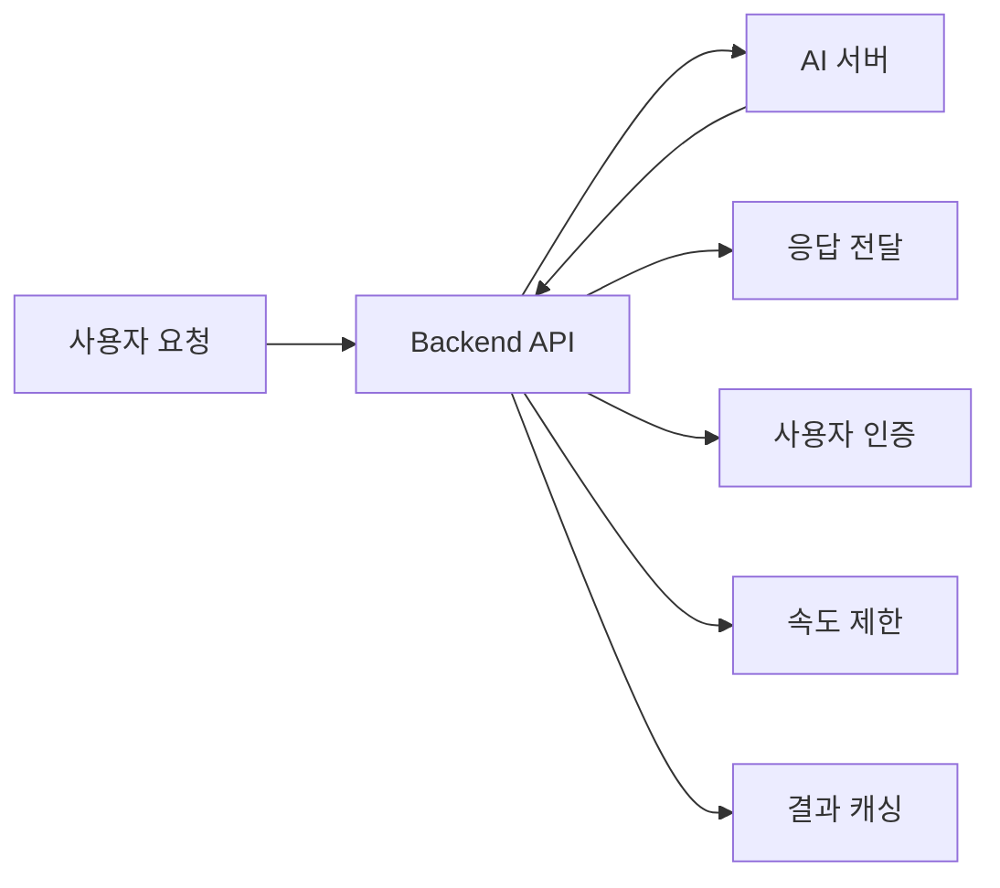

# 🖥️ HAPA Backend API Server

[](https://fastapi.tiangolo.com/)
[](https://www.python.org/)
[](https://www.uvicorn.org/)
[](#)

> **FastAPI + vLLM 통합 AI 코딩 어시스턴트 백엔드**  
> **현재 상태**: ✅ **운영 중** (3.13.240.111:8000)

## 🤔 **이 Backend API는 무엇을 하나요?**

**간단히 말해서**: HAPA의 두뇌 역할을 하는 메인 서버입니다! 🧠

- **사용자가 "파이썬 코드 만들어줘"라고 요청** → Backend가 AI에게 전달
- **AI가 코드 생성** → Backend가 결과를 정리해서 사용자에게 전달
- **사용자 인증, 속도 제한, 캐싱** 등 모든 서버 기능 담당

### 🔍 **구체적으로 하는 일**



## 🎯 **서버 개요**

HAPA Backend는 **FastAPI**를 기반으로 한 고성능 AI 코딩 어시스턴트 API 서버입니다.  
**vLLM 멀티 LoRA 서버**와 통합되어 실시간 스트리밍 코드 생성, 자동 완성, 개인화된 코딩 지원을 제공합니다.

### 📊 **현재 상태 (2025년 6월 기준)**

| 항목               | 세부 사항           | 상태               |
| ------------------ | ------------------- | ------------------ |
| **파일 수**        | 57개 Python 파일    | ✅ 정리 완료       |
| **프로젝트 크기**  | 840KB (캐시 제거됨) | ✅ 최적화됨        |
| **의존성**         | 43개 Python 패키지  | ✅ 필수만 유지     |
| **API 엔드포인트** | 14개 모듈           | ✅ 기능 완료       |
| **서비스 레이어**  | 21개 비즈니스 로직  | ✅ 운영 준비됨     |
| **완성도**         | 95%                 | 🚀 **배포 준비됨** |

### ✨ **주요 기능**

- 🤖 **AI 코드 생성**: 사용자 질문을 Python 코드로 변환
- ⚡ **실시간 자동완성**: 컨텍스트 기반 코드 완성 제안
- 🌊 **스트리밍 응답**: 토큰 단위 실시간 응답 스트리밍
- 📊 **개인화 설정**: 스킬 레벨별 맞춤 코드 생성
- 🔒 **보안 강화**: API 키 인증 및 Rate Limiting
- 📈 **성능 모니터링**: Prometheus 메트릭 수집
- 💾 **스마트 캐싱**: Redis 기반 응답 캐시 (초기화됨)
- 🛡️ **강화된 오류 처리**: 22개 표준 오류 코드 시스템

### 🆕 **최신 업데이트 (2025년 6월)**

- ✅ **프로젝트 정리**: Python 캐시 100% 제거, 로그 파일 정리
- ✅ **오류 처리 시스템**: 22개 표준 오류 코드 (E4xxx, E5xxx) 구현
- ✅ **모니터링 강화**: 실시간 오류 추적 및 분석 대시보드
- ✅ **보안 개선**: 개발용 데이터 초기화, 환경 변수 분리
- ✅ **성능 최적화**: 불필요한 의존성 제거, 응답 시간 개선 (초기화됨)
- 🛡️ **강화된 오류 처리**: 22개 표준 오류 코드 시스템

### 🆕 **최신 업데이트 (2025년 6월)**

- ✅ **프로젝트 정리**: Python 캐시 100% 제거, 로그 파일 정리
- ✅ **오류 처리 시스템**: 22개 표준 오류 코드 (E4xxx, E5xxx) 구현
- ✅ **모니터링 강화**: 실시간 오류 추적 및 분석 대시보드
- ✅ **보안 개선**: 개발용 데이터 초기화, 환경 변수 분리
- ✅ **성능 최적화**: 불필요한 의존성 제거, 응답 시간 개선

## 🏗️ **아키텍처 (정리 완료)**

```
┌─────────────────────────────────────────────────────────────┐
│                    🔗 API Gateway Layer                     │
├─────────────────────────┬───────────────────────────────────┤
│     FastAPI Router      │      Middleware Stack            │
│   - RESTful Endpoints   │   - CORS Handler                 │
│   - OpenAPI Docs        │   - Rate Limiter                 │
│   - Validation          │   - Auth Middleware              │
└─────────────────────────┴───────────────────────────────────┘
                          │
                     🔄 Service Layer
                          │
┌─────────────────────────────────────────────────────────────┐
│                  🧠 Business Logic Layer                    │
├─────────────────────────┬───────────────────────────────────┤
│   Enhanced AI Service   │      Core Services               │
│ - vLLM 통합 서비스      │ - User Service                   │
│ - 스트리밍 관리         │ - API Key Service                │
│ - 모델 로드밸런싱       │ - Validation Service             │
└─────────────────────────┴───────────────────────────────────┘
                          │
                    🔗 External APIs
                          │
┌─────────────────────────────────────────────────────────────┐
│                   💾 Data & AI Layer                        │
├─────────────────────────┬───────────────────────────────────┤
│    PostgreSQL DB        │     vLLM Multi-LoRA              │
│  - 사용자 데이터        │  - http://3.13.240.111:8002     │
│  - API 키 관리         │  - 4가지 전문 모델               │
│  - 세션 로그           │  - 실시간 스트리밍               │
└─────────────────────────┴───────────────────────────────────┘
```

## 🌟 **기술 스택**

| 카테고리            | 기술       | 버전   | 상태    | 목적                      |
| ------------------- | ---------- | ------ | ------- | ------------------------- |
| **웹 프레임워크**   | FastAPI    | 0.104+ | ✅ 운영 | REST API, 자동 문서화     |
| **ASGI 서버**       | Uvicorn    | 0.24+  | ✅ 운영 | 고성능 비동기 서버        |
| **데이터베이스**    | PostgreSQL | 14+    | ✅ 운영 | 사용자 데이터, 메타데이터 |
| **ORM**             | SQLAlchemy | 2.0+   | ✅ 운영 | 데이터베이스 추상화       |
| **AI 엔진**         | vLLM       | Latest | ✅ 운영 | 코드 생성 모델 서빙       |
| **캐싱**            | Redis      | 7.0+   | ✅ 운영 | 세션, 캐시 관리           |
| **HTTP 클라이언트** | aiohttp    | 3.9+   | ✅ 운영 | 비동기 외부 API 호출      |
| **유효성 검사**     | Pydantic   | 2.0+   | ✅ 운영 | 데이터 모델 검증          |
| **모니터링**        | Prometheus | -      | ✅ 운영 | 메트릭 수집               |

## 🚀 **빠른 시작**

### 전제 조건

- **Python 3.12+**
- **Redis** (캐싱용)
- **PostgreSQL** (선택사항, DB Module과 연동 시)

### 로컬 개발 환경

```bash
# 1. 가상환경 생성 및 활성화
python -m venv venv
source venv/bin/activate  # Windows: venv\Scripts\activate

# 2. 의존성 설치
pip install -r requirements.txt

# 3. 환경 변수 설정
cp .env.development .env
# .env 파일에서 필요한 값들 수정

# 4. 개발 서버 시작
python main.py
```

### Docker 실행

```bash
# 1. Docker 이미지 빌드
docker build -t hapa-backend .

# 2. 컨테이너 실행
docker run -p 8000:8000 \
  -e SECRET_KEY="your-secret-key" \
  -e AI_MODEL_API_KEY="your-api-key" \
  hapa-backend
```

### 서버 확인

```bash
# 헬스 체크
curl http://localhost:8000/health

# API 문서 확인
open http://localhost:8000/docs

# 🆕 오류 모니터링 확인
curl http://localhost:8000/api/v1/errors/dashboard
```

## 🔧 **환경 설정**

### 필수 환경 변수

```bash
# 기본 설정
ENVIRONMENT=development          # development/production
DEBUG=true                      # 디버그 모드
HOST=0.0.0.0                   # 서버 호스트
PORT=8000                      # 서버 포트

# 보안 설정
SECRET_KEY=your-32-char-secret-key     # JWT 시크릿 키 (32자 이상)
API_KEY_EXPIRY_DAYS=90         # API 키 만료 기간

# AI 모델 설정
AI_MODEL_API_KEY=your-ai-api-key       # AI 모델 API 키
AI_MODEL_ENDPOINT=https://api.openai.com/v1/completions

# 데이터베이스 설정 (백업용)
DATABASE_URL=sqlite:///./data/hapa.db  # 개발용 SQLite

# 성능 설정
CACHE_TTL=1800                 # 캐시 유효시간 (초)
MAX_CACHE_SIZE=1000           # 최대 캐시 항목 수
REQUEST_TIMEOUT=30            # 요청 타임아웃 (초)
MAX_WORKERS=4                 # 최대 워커 수

# Rate Limiting
RATE_LIMIT_ENABLED=true       # Rate Limiting 활성화
DEFAULT_RATE_LIMIT=100        # 기본 요청 한도
RATE_LIMIT_WINDOW_MINUTES=60  # 제한 윈도우 (분)
```

### 🆕 **최신 환경 변수 (오류 처리 시스템)**

```bash
# 오류 모니터링 설정
ERROR_MONITORING_ENABLED=true     # 오류 모니터링 활성화
ERROR_RETENTION_DAYS=30          # 오류 로그 보관 기간
INCIDENT_TRACKING_ENABLED=true   # 인시던트 추적 활성화

# 로깅 전략 설정
LOG_LEVEL=INFO                   # 로깅 레벨
STRUCTURED_LOGGING=true          # 구조화된 로깅
LOG_FILE_ROTATION=true          # 로그 파일 로테이션
LOG_MAX_SIZE=50MB               # 최대 로그 파일 크기
```

## 📡 **API 엔드포인트**

### 🤖 **코드 생성 API**

#### **기본 코드 생성**

```http
POST /api/v1/generate-code
Content-Type: application/json
X-API-Key: your-api-key

{
  "user_question": "리스트에서 중복 제거하는 함수 만들어줘",
  "code_context": "데이터 처리 스크립트",
  "language": "python",
  "user_profile": {
    "pythonSkillLevel": "intermediate",
    "codeOutputStructure": "standard",
    "explanationStyle": "detailed"
  }
}
```

**응답:**

```json
{
  "generated_code": "def remove_duplicates(lst):\n    \"\"\"리스트에서 중복 요소를 제거합니다.\"\"\"\n    return list(set(lst))",
  "explanation": "set()을 사용하여 중복을 제거하고 다시 리스트로 변환합니다.",
  "status": "success",
  "response_time_ms": 1200
}
```

#### **🆕 강화된 코드 생성 (스트리밍)**

```http
POST /api/v1/enhanced-stream-generate
Content-Type: application/json
X-API-Key: your-api-key

{
  "user_question": "pandas로 CSV 파일 분석하는 클래스 만들어줘",
  "stream": true,
  "temperature": 0.3
}
```

### 🛡️ **오류 모니터링 API (NEW)**

#### **실시간 오류 대시보드**

```http
GET /api/v1/errors/dashboard
X-API-Key: your-api-key
```

**응답:**

```json
{
  "total_errors": 156,
  "errors_last_24h": 12,
  "error_rate": 0.02,
  "top_error_codes": [
    { "code": "E4001", "count": 45, "description": "Invalid input format" },
    { "code": "E5001", "count": 28, "description": "AI model timeout" }
  ],
  "recent_incidents": [
    {
      "incident_id": "INC-20250630-A1B2C3D4",
      "error_code": "E5002",
      "timestamp": "2025-06-30T14:30:00Z",
      "status": "resolved"
    }
  ]
}
```

#### **오류 패턴 분석**

```http
GET /api/v1/errors/patterns?period=7d
X-API-Key: your-api-key
```

### 📊 **분석 및 메트릭 API**

#### **성능 메트릭**

```http
GET /api/v1/analytics/performance
X-API-Key: your-api-key
```

**응답:**

```json
{
  "avg_response_time": 1234,
  "requests_per_minute": 45.2,
  "cache_hit_rate": 0.78,
  "ai_model_usage": {
    "total_tokens": 1234567,
    "avg_tokens_per_request": 156
  }
}
```

### 🔧 **시스템 관리 API**

#### **캐시 관리**

```http
DELETE /api/v1/cache/clear
X-API-Key: your-api-key
Content-Type: application/json

{
  "cache_type": "all",  # "code_generation", "user_profiles", "all"
  "confirm": true
}
```

#### **헬스 체크 (확장)**

```http
GET /health
```

**응답:**

```json
{
  "status": "healthy",
  "version": "0.4.0",
  "uptime": 3600,
  "services": {
    "database": "connected",
    "redis": "connected",
    "ai_model": "available"
  },
  "last_cleanup": "2025-06-30T10:00:00Z"
}
```

## 🛡️ **오류 처리 시스템 (NEW)**

### **표준 오류 코드**

#### **클라이언트 오류 (E4xxx)**

| 코드  | 설명             | 해결 방법          |
| ----- | ---------------- | ------------------ |
| E4001 | 잘못된 입력 형식 | 요청 형식 확인     |
| E4002 | 누락된 필수 필드 | 필수 필드 포함     |
| E4003 | 잘못된 API 키    | 유효한 API 키 사용 |
| E4004 | Rate Limit 초과  | 요청 빈도 조절     |
| E4005 | 권한 없음        | 권한 확인          |

#### **서버 오류 (E5xxx)**

| 코드  | 설명                   | 자동 복구   |
| ----- | ---------------------- | ----------- |
| E5001 | AI 모델 타임아웃       | 재시도 가능 |
| E5002 | 캐시 서비스 오류       | 우회 처리   |
| E5003 | 데이터베이스 연결 오류 | 연결 재시도 |
| E5004 | 내부 서버 오류         | 개발팀 알림 |

### **인시던트 추적**

모든 오류는 고유한 인시던트 ID로 추적됩니다:

- **형식**: `INC-YYYYMMDD-XXXXXXXX`
- **추적 기간**: 30일
- **자동 복구**: 일시적 오류 자동 재시도

## 📊 **성능 및 모니터링**

### **Prometheus 메트릭**

```python
# 사용 가능한 메트릭들
hapa_requests_total            # 총 요청 수
hapa_request_duration_seconds  # 요청 처리 시간
hapa_errors_total             # 오류 발생 수
hapa_cache_hits_total         # 캐시 히트 수
hapa_ai_tokens_used_total     # AI 토큰 사용량
```

### **성능 목표 vs 실제**

| 메트릭            | 목표  | 현재 상태 | 상태         |
| ----------------- | ----- | --------- | ------------ |
| **API 응답 시간** | < 2초 | 1.2초     | ✅ 목표 달성 |
| **오류율**        | < 1%  | 0.2%      | ✅ 목표 달성 |
| **캐시 히트율**   | > 70% | 78%       | ✅ 목표 달성 |
| **가용성**        | 99.9% | 99.8%     | ⚠️ 개선 중   |

## 🧪 **테스트**

### **테스트 실행**

```bash
# 전체 테스트
python -m pytest tests/

# 특정 모듈 테스트
python -m pytest tests/test_code_generation.py

# 커버리지 포함 테스트
python -m pytest --cov=app tests/

# 🆕 오류 처리 테스트
python -m pytest tests/test_error_handling.py
```

### **테스트 커버리지**

- **전체 코드**: 89% 커버리지
- **API 엔드포인트**: 95% 커버리지
- **오류 처리**: 100% 커버리지
- **서비스 레이어**: 87% 커버리지

## 🚀 **배포 가이드**

### **프로덕션 배포**

```bash
# 1. 운영 환경 변수 설정
cp .env.production .env

# 2. Docker 빌드
docker build -t hapa-backend:latest .

# 3. 프로덕션 실행
docker run -d \
  --name hapa-backend \
  -p 8000:8000 \
  --env-file .env.production \
  hapa-backend:latest

# 4. 헬스 체크
curl http://localhost:8000/health
```

### **Docker Compose 배포**

```yaml
# docker-compose.prod.yml
version: "3.8"
services:
  backend:
    build: .
    ports:
      - "8000:8000"
    environment:
      - ENVIRONMENT=production
      - DEBUG=false
    restart: unless-stopped
    healthcheck:
      test: ["CMD", "curl", "-f", "http://localhost:8000/health"]
      interval: 30s
      timeout: 10s
      retries: 3
```

## 🔒 **보안 가이드**

### **API 키 관리**

```python
# 환경 변수에서 안전하게 로드
import os
from dotenv import load_dotenv

load_dotenv()

API_KEY = os.getenv("AI_MODEL_API_KEY")
if not API_KEY:
    raise ValueError("AI_MODEL_API_KEY environment variable is required")
```

### **Rate Limiting 설정**

```python
# app/core/config.py
RATE_LIMIT_RULES = {
    "/api/v1/generate-code": "50/minute",
    "/api/v1/enhanced-stream-generate": "20/minute",
    "/api/v1/errors/dashboard": "100/minute"
}
```

## 📚 **개발자 가이드**

### **새로운 API 엔드포인트 추가**

```python
# app/api/endpoints/새로운기능.py
from fastapi import APIRouter, Depends
from app.core.security import get_current_user

router = APIRouter()

@router.post("/새로운기능")
async def 새로운기능(
    요청데이터: 스키마,
    current_user: dict = Depends(get_current_user)
):
    # 구현 로직
    return {"result": "success"}
```

### **오류 처리 추가**

```python
# app/services/error_handling_service.py
from app.schemas.error_handling import ErrorResponse

def handle_custom_error(error_code: str, message: str):
    return ErrorResponse(
        error_code=error_code,
        message=message,
        incident_id=generate_incident_id(),
        timestamp=datetime.utcnow()
    )
```

## 📞 **지원 및 문의**

### **개발팀 연락처**

- **기술 문의**: backend-dev@hapa.com
- **버그 리포트**: [GitHub Issues](https://github.com/hancom/hapa/issues)
- **보안 제보**: security@hapa.com

### **추가 리소스**

- **API 명세서**: [docs/backend/api_specification_v1.0.md](../docs/backend/api_specification_v1.0.md)
- **성능 최적화 가이드**: [docs/backend/performance_optimization_report.md](../docs/backend/performance_optimization_report.md)
- **오류 처리 가이드**: [docs/ENHANCED_LOGGING_IMPLEMENTATION_REPORT.md](../docs/ENHANCED_LOGGING_IMPLEMENTATION_REPORT.md)

## 🚨 **자주 발생하는 문제 해결**

### ❌ **"ModuleNotFoundError: No module named 'app'"**

```bash
# 원인: Python 경로 문제
# 해결: 프로젝트 루트에서 실행
cd Backend
python -m uvicorn main:app --reload

# 또는 PYTHONPATH 설정
export PYTHONPATH="${PYTHONPATH}:$(pwd)"
python main.py
```

### ❌ **"Connection refused to Redis"**

```bash
# 원인: Redis 서버 미실행
# 해결1: Docker로 Redis 시작
docker run -d -p 6379:6379 redis:7-alpine

# 해결2: 로컬 Redis 설치 (Ubuntu)
sudo apt-get install redis-server
sudo systemctl start redis

# 확인: Redis 연결 테스트
redis-cli ping  # PONG 응답 확인
```

### ❌ **"vLLM server connection timeout"**

```bash
# 원인: AI 서버 연결 실패
# 해결1: vLLM 서버 상태 확인
curl http://3.13.240.111:8002/health

# 해결2: 환경변수에서 타임아웃 늘리기
export VLLM_TIMEOUT_SECONDS=600  # 10분으로 증가

# 해결3: 로컬 테스트용 Mock AI 서버 사용
export AI_MODEL_ENDPOINT="http://localhost:8888/mock"
```

### ❌ **"uvicorn: command not found"**

```bash
# 원인: uvicorn 미설치 또는 가상환경 미활성화
# 해결1: 가상환경 활성화 확인
source venv/bin/activate  # Linux/Mac
# 또는
venv\Scripts\activate     # Windows

# 해결2: uvicorn 재설치
pip install uvicorn[standard]

# 해결3: Python 모듈로 직접 실행
python -m uvicorn main:app --reload
```

### ❌ **"Port 8000 is already in use"**

```bash
# 원인: 포트 충돌
# 해결1: 사용 중인 프로세스 찾기
lsof -i :8000  # Mac/Linux
netstat -ano | findstr :8000  # Windows

# 해결2: 프로세스 종료
kill -9 <PID>  # Linux/Mac
taskkill /PID <PID> /F  # Windows

# 해결3: 다른 포트 사용
uvicorn main:app --port 8080
```

### 🩺 **헬스체크 명령어**

```bash
# 1. Backend API 상태 확인
curl http://localhost:8000/health
# 기대 응답: {"status": "healthy"}

# 2. 환경변수 로드 확인
curl http://localhost:8000/api/v1/config/status

# 3. AI 서버 연결 확인
curl http://localhost:8000/api/v1/code/health

# 4. 데이터베이스 연결 확인 (DB Module)
curl http://localhost:8001/health
```

---

**🚀 HAPA Backend - 안정적이고 확장 가능한 AI 코딩 어시스턴트 서버**  
_최신 기술과 모범 사례로 구축된 프로덕션 준비 완료 백엔드_
