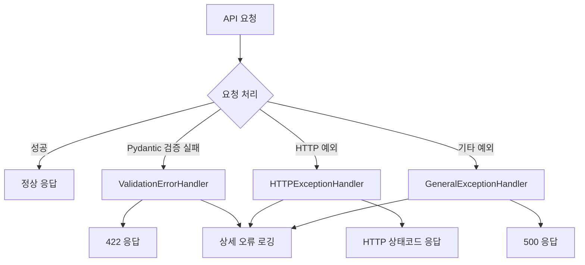

# HAPA 백엔드 예외 핸들러 구현 문서

**작성일**: 2024년 12월 28일  
**버전**: v1.0  
**목적**: 포괄적인 예외 처리 시스템 구현

---

## 📋 **1. 유효성 검사 오류 핸들러** (422)

### **구현 코드**

```python
@app.exception_handler(RequestValidationError)
async def validation_exception_handler(request: Request, exc: RequestValidationError):
    """
    Pydantic 유효성 검사 실패 시 표준 오류 응답을 반환합니다.
    """
    api_monitor.logger.warning(
        f"유효성 검사 실패: {request.url.path}",
        errors=exc.errors(),
        client_ip=request.client.host if request.client else "unknown"
    )

    # 필드별 오류 메시지 정리
    error_details = {}
    for error in exc.errors():
        field_path = ".".join(str(loc) for loc in error["loc"][1:])  # 'body' 제외
        if field_path not in error_details:
            error_details[field_path] = []
        error_details[field_path].append(error["msg"])

    # 주요 오류 메시지 추출
    main_error_msg = exc.errors()[0]["msg"] if exc.errors() else "유효성 검사에 실패했습니다."

    error_response = ValidationErrorResponse(
        error_message=f"요청 데이터 유효성 검사에 실패했습니다: {main_error_msg}",
        error_details=error_details
    )

    return JSONResponse(
        status_code=422,
        content=error_response.model_dump()
    )
```

### **처리 범위**

- Pydantic 모델 유효성 검사 실패
- 필드별 오류 메시지 상세 분석
- 구조화된 오류 정보 제공

---

## 📋 **2. HTTP 예외 핸들러** (400, 401, 403, 404, 429 등)

### **구현 코드**

```python
@app.exception_handler(HTTPException)
async def http_exception_handler(request: Request, exc: HTTPException):
    """
    HTTPException 발생 시 표준 오류 응답을 반환합니다.
    """
    api_monitor.logger.warning(
        f"HTTP 예외 발생: {request.url.path}",
        status_code=exc.status_code,
        detail=exc.detail,
        client_ip=request.client.host if request.client else "unknown"
    )

    # 상태 코드별 오류 코드 매핑
    error_code_mapping = {
        400: "BAD_REQUEST",
        401: "UNAUTHORIZED",
        403: "FORBIDDEN",
        404: "NOT_FOUND",
        405: "METHOD_NOT_ALLOWED",
        409: "CONFLICT",
        429: "TOO_MANY_REQUESTS",
        500: "INTERNAL_SERVER_ERROR",
        502: "BAD_GATEWAY",
        503: "SERVICE_UNAVAILABLE"
    }

    error_response = ErrorResponse(
        error_message=str(exc.detail),
        error_code=error_code_mapping.get(exc.status_code, "HTTP_ERROR")
    )

    return JSONResponse(
        status_code=exc.status_code,
        content=error_response.model_dump()
    )
```

### **처리 범위**

- FastAPI HTTPException 전체
- 인증/인가 오류 (401, 403)
- Rate Limiting 오류 (429)
- 일반적인 HTTP 오류들

---

## 📋 **3. 일반 예외 핸들러** (500)

### **구현 코드**

```python
@app.exception_handler(Exception)
async def general_exception_handler(request: Request, exc: Exception):
    """
    예상치 못한 모든 내부 서버 오류를 처리합니다.
    민감한 정보가 노출되지 않도록 일반적인 오류 메시지를 반환합니다.
    """
    api_monitor.log_error(
        exc,
        {
            "request_path": str(request.url.path),
            "request_method": request.method,
            "client_ip": request.client.host if request.client else "unknown"
        }
    )

    # 개발 환경에서는 상세한 오류 정보 포함
    if settings.DEBUG:
        error_message = f"내부 서버 오류가 발생했습니다: {type(exc).__name__}: {str(exc)}"
        error_details = {
            "exception_type": type(exc).__name__,
            "exception_message": str(exc),
            "request_path": str(request.url.path),
            "request_method": request.method
        }
    else:
        error_message = "내부 서버 오류가 발생했습니다. 잠시 후 다시 시도해주세요."
        error_details = None

    error_response = ErrorResponse(
        error_message=error_message,
        error_code="INTERNAL_SERVER_ERROR",
        error_details=error_details
    )

    return JSONResponse(
        status_code=500,
        content=error_response.model_dump()
    )
```

### **처리 범위**

- 예상치 못한 모든 Python 예외
- 개발/프로덕션 환경별 차별화된 응답
- 보안을 고려한 정보 노출 제어

---

## 📋 **4. 예외 처리 플로우**



---

## 📋 **5. 로깅 및 모니터링 통합**

### **오류 로깅 구조**

```python
# 모든 예외 핸들러에서 공통으로 사용되는 로깅
api_monitor.logger.warning(
    f"오류 발생: {request.url.path}",
    error_type=type(exc).__name__,
    client_ip=request.client.host,
    user_agent=request.headers.get("user-agent"),
    request_id=request.headers.get("x-request-id")
)
```

### **Prometheus 메트릭 업데이트**

```python
# 오류 발생 시 자동으로 메트릭 업데이트
ERROR_COUNT.labels(error_type=type(exc).__name__).inc()
REQUEST_COUNT.labels(method=request.method, endpoint=request.url.path, status=status_code).inc()
```

---

## 📋 **6. 테스트 케이스**

### **유효성 검사 오류 테스트**

```bash
curl -X POST http://localhost:8000/api/v1/code/generate \
  -H "Content-Type: application/json" \
  -d '{"invalid_field": "value"}'

# 예상 응답: 422 VALIDATION_ERROR
```

### **인증 오류 테스트**

```bash
curl -X POST http://localhost:8000/api/v1/code/generate \
  -H "Content-Type: application/json" \
  -d '{"user_question": "Hello World"}'

# 예상 응답: 401 UNAUTHORIZED
```

### **Rate Limiting 테스트**

```bash
# 50회 이상 요청 시
# 예상 응답: 429 TOO_MANY_REQUESTS
```
