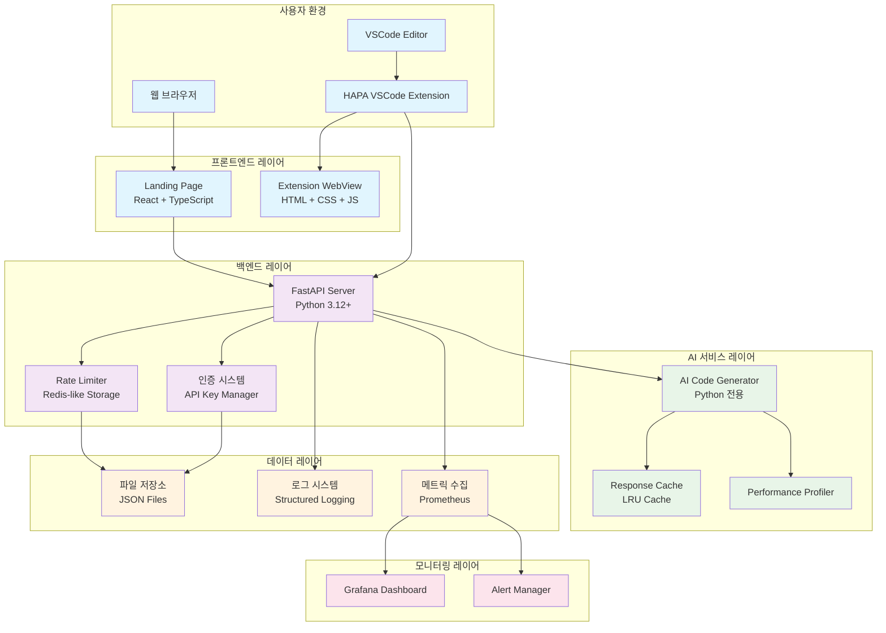
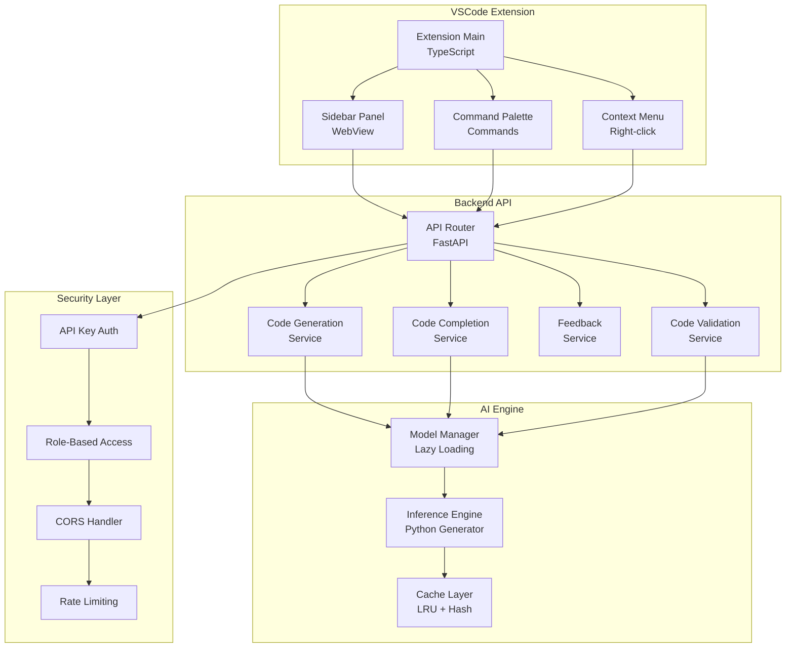
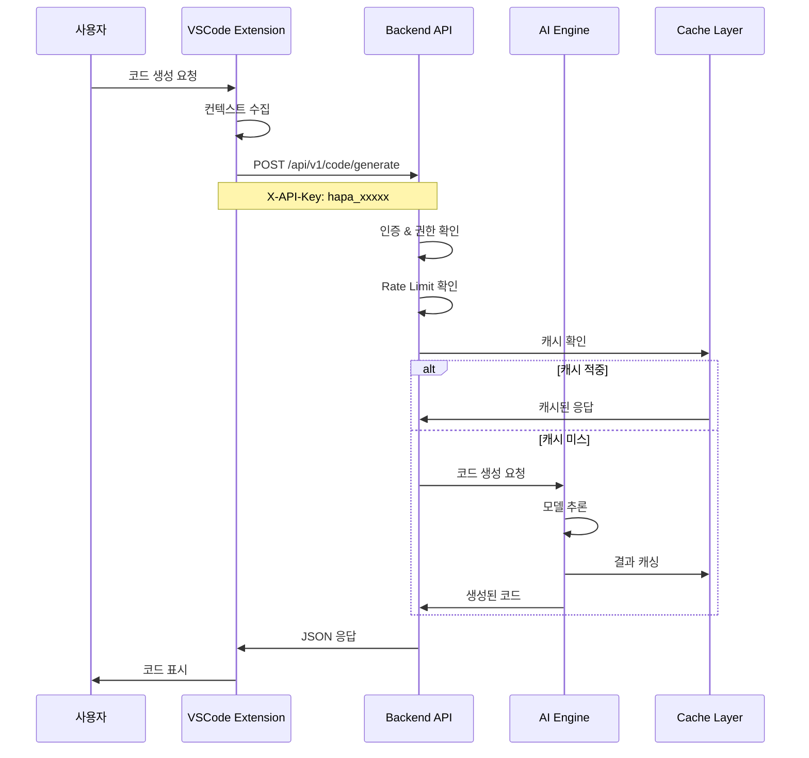
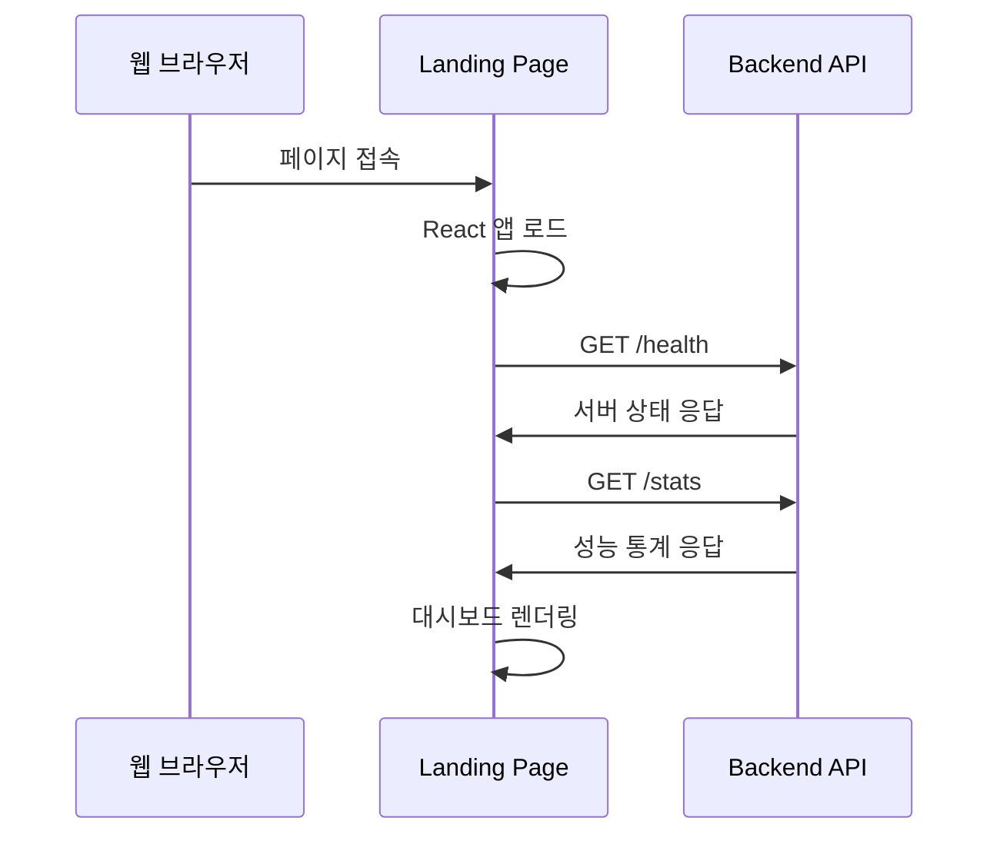
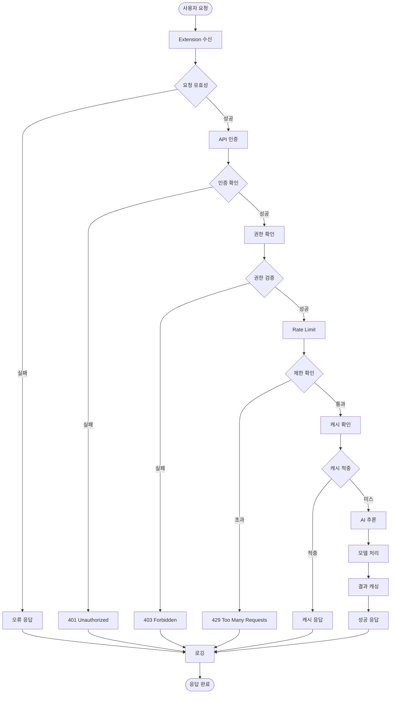
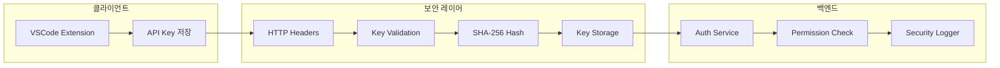
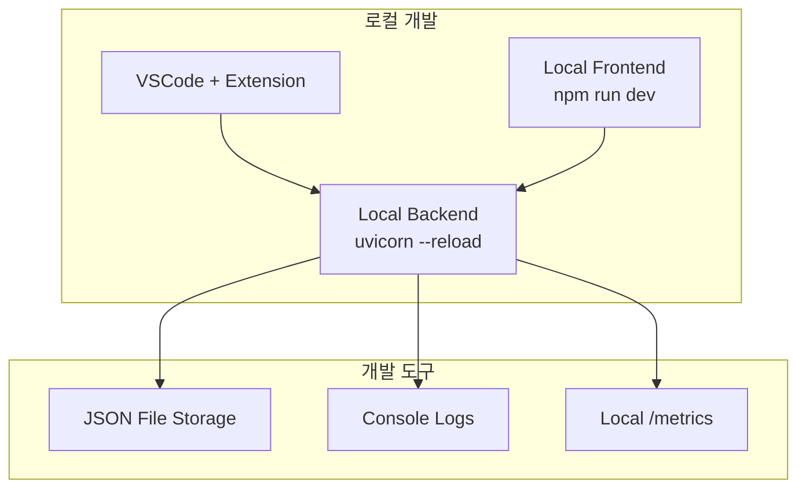
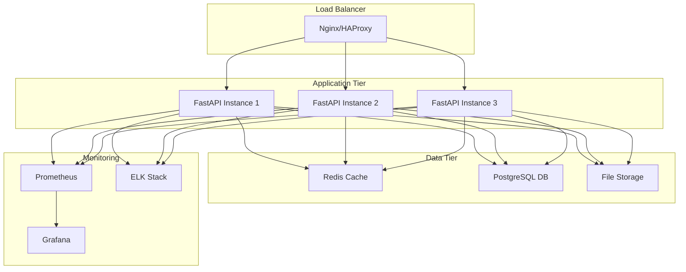
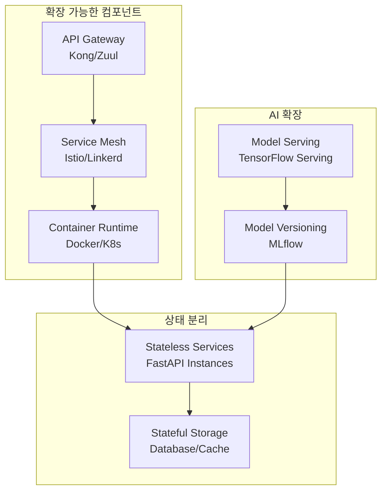
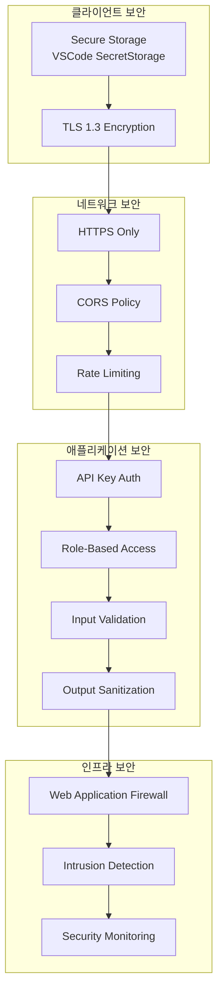

# HAPA 시스템 아키텍처 v2.0 및 컴포넌트 간 통신 정의

**작성일**: 2024년 12월 28일  
**버전**: v2.0  
**목적**: 전체 시스템 아키텍처 및 컴포넌트 간 통신 구조 정의

---

## 📋 **1. 전체 시스템 아키텍처 다이어그램**

### **1.1 High-Level 아키텍처**



### **1.2 상세 컴포넌트 구조**



---

## 📋 **2. 컴포넌트 간 통신 정의**

### **2.1 VSCode Extension ↔ Backend API 통신**

#### **통신 프로토콜**

- **프로토콜**: HTTP/HTTPS REST API
- **데이터 형식**: JSON
- **인증**: API Key (X-API-Key 헤더)
- **포트**: 8000 (기본값)

#### **통신 플로우**



#### **API 통신 인터페이스**

```typescript
// VSCode Extension - API 클라이언트
interface HAPAApiClient {
  // 코드 생성
  generateCode(request: CodeGenerationRequest): Promise<CodeGenerationResponse>;

  // 자동 완성
  completeCode(request: CompletionRequest): Promise<CompletionResponse>;

  // 피드백 제출
  submitFeedback(request: FeedbackRequest): Promise<FeedbackResponse>;

  // 코드 검증
  validateCode(request: ValidationRequest): Promise<ValidationResponse>;
}

// 요청 타입
interface CodeGenerationRequest {
  user_question: string;
  code_context?: string;
  language: "python";
  file_path?: string;
}

// 응답 타입
interface CodeGenerationResponse {
  generated_code: string;
  explanation?: string;
  status: "success" | "error";
  error_message?: string;
}
```

### **2.2 Frontend ↔ Backend 통신**

#### **Landing Page 통신**



#### **WebView 통신**

```typescript
// Extension WebView 통신
interface WebViewMessage {
  command: "generateCode" | "getContext" | "showResult";
  data: any;
}

// WebView -> Extension 메시지
vscode.postMessage({
  command: "generateCode",
  data: {
    question: "Hello World 함수 만들어줘",
    context: getCurrentContext(),
  },
});

// Extension -> WebView 메시지
panel.webview.postMessage({
  command: "showResult",
  data: {
    code: generatedCode,
    explanation: explanation,
  },
});
```

### **2.3 Backend 내부 컴포넌트 통신**

#### **API Layer ↔ Service Layer**

```python
# API Router -> Service 통신
@router.post("/generate", response_model=CodeGenerationResponse)
async def generate_code(
    request: CodeGenerationRequest,
    api_key: Dict[str, Any] = Depends(require_permission("code_generation"))
):
    # Service Layer 호출
    result = await ai_service.generate_python_code(
        prompt=request.user_question,
        context=request.code_context,
        user_id=api_key["user_id"]
    )

    return CodeGenerationResponse(
        generated_code=result["code"],
        explanation=result.get("explanation"),
        status="success"
    )
```

#### **Service Layer ↔ AI Engine**

```python
# AI Service 내부 통신
class AIModelService:
    async def generate_python_code(self, prompt: str, context: str = None, user_id: str = None) -> Dict[str, str]:
        # 캐시 확인
        cache_key = self._generate_cache_key(prompt, context)
        cached_result = await self.cache.get(cache_key)

        if cached_result:
            return cached_result

        # AI 모델 추론
        with performance_profiler.profile_function("ai_inference"):
            result = await self.model.predict_async(prompt, context)

        # 결과 캐싱
        await self.cache.set(cache_key, result, ttl=3600)

        return result
```

---

## 📋 **3. 데이터 흐름 아키텍처**

### **3.1 요청 처리 데이터 플로우**



### **3.2 보안 데이터 흐름**



---

## 📋 **4. 성능 최적화 아키텍처**

### **4.1 캐싱 전략**

```mermaid
graph TD
    subgraph "Multi-Level Cache"
        L1[Level 1: In-Memory<br/>LRU Cache (128개)]
        L2[Level 2: File System<br/>JSON Cache]
        L3[Level 3: Response Cache<br/>Hash-based]
    end

    subgraph "Cache Keys"
        UserKey[User + Question Hash]
        ContextKey[Context Hash]
        CombinedKey[Combined Cache Key]
    end

    Request[API 요청] --> L1
    L1 -->|미스| L2
    L2 -->|미스| L3
    L3 -->|미스| AI[AI 처리]

    UserKey --> CombinedKey
    ContextKey --> CombinedKey
    CombinedKey --> L1

    AI --> Store[캐시 저장]
    Store --> L3
    Store --> L2
    Store --> L1
```

### **4.2 모니터링 아키텍처**

```mermaid
graph LR
    subgraph "Application"
        API[FastAPI App]
        Logger[Structured Logger]
        Metrics[Prometheus Metrics]
    end

    subgraph "Collection"
        LogFile[Log Files]
        MetricEndpoint[/metrics Endpoint]
    end

    subgraph "Analysis"
        Prometheus[Prometheus Server]
        Grafana[Grafana Dashboard]
        Alerts[Alert Manager]
    end

    API --> Logger
    API --> Metrics
    Logger --> LogFile
    Metrics --> MetricEndpoint

    LogFile --> Prometheus
    MetricEndpoint --> Prometheus
    Prometheus --> Grafana
    Prometheus --> Alerts
```

---

## 📋 **5. 배포 아키텍처**

### **5.1 개발 환경**



### **5.2 프로덕션 환경 (계획)**



---

## 📋 **6. 확장성 고려사항**

### **6.1 수평 확장 전략**



### **6.2 마이크로서비스 분리 계획**

| 서비스                      | 책임         | 기술 스택               | 확장성          |
| --------------------------- | ------------ | ----------------------- | --------------- |
| **Auth Service**            | 인증/인가    | FastAPI + JWT           | Stateless       |
| **Code Generation Service** | AI 코드 생성 | FastAPI + AI Model      | GPU 확장        |
| **Validation Service**      | 코드 검증    | FastAPI + AST           | CPU 확장        |
| **Feedback Service**        | 피드백 수집  | FastAPI + Queue         | Message Queue   |
| **Analytics Service**       | 사용량 분석  | FastAPI + TimeSeries DB | 데이터 파티셔닝 |

---

## 📋 **7. 보안 아키텍처**

### **7.1 Security-by-Design**



---

## 📋 **8. 결론**

HAPA 시스템은 **모듈러 아키텍처**를 기반으로 하여 각 컴포넌트가 독립적으로 확장 가능하도록 설계되었습니다.

**핵심 설계 원칙**:

- ✅ **분리된 관심사**: 각 레이어별 명확한 책임 분리
- ✅ **확장 가능성**: 수평/수직 확장 모두 지원
- ✅ **보안 우선**: Security-by-Design 적용
- ✅ **모니터링**: 전 구간 관찰 가능성 확보
- ✅ **성능 최적화**: 다중 레벨 캐싱 및 최적화

현재 **v2.0 아키텍처**는 MVP 요구사항을 충족하면서도 향후 엔터프라이즈급 확장을 위한 기반을 마련했습니다.
