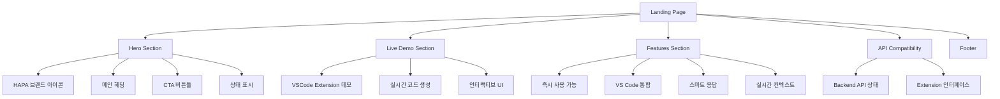

# HAPA 웹 인터페이스 기술 스택 확정 문서 및 랜딩 페이지/웹뷰 아이디어 스케치

**작성일**: 2024년 12월 28일  
**버전**: v1.0  
**목적**: 웹 인터페이스 기술 스택 확정 및 UI/UX 아이디어 스케치

---

## 📋 **1. 웹 인터페이스 기술 스택 분석**

### **1.1 현재 구현된 Landing Page 기술 스택**

#### **Core Technology Stack**

```json
{
  "name": "hapa-landing-page",
  "version": "0.1.0",
  "description": "HAPA (Hancom AI Python Assistant) - 웹 랜딩 페이지",
  "author": "하이들 (Hi-dle) Team",
  "dependencies": {
    "react": "^19.1.0",
    "react-dom": "^19.1.0",
    "react-router-dom": "^7.6.2",
    "typescript": "^4.9.5",
    "@types/react": "^19.1.7",
    "@types/react-dom": "^19.1.6"
  },
  "devDependencies": {
    "tailwindcss": "^3.3.3",
    "autoprefixer": "^10.4.15",
    "postcss": "^8.4.29"
  }
}
```

#### **기술 스택 상세 분석**

| 기술             | 버전   | 역할           | 선택 이유                                   |
| ---------------- | ------ | -------------- | ------------------------------------------- |
| **React**        | 19.1.0 | UI 프레임워크  | 컴포넌트 기반 아키텍처, VSCode WebView 호환 |
| **TypeScript**   | 4.9.5  | 개발 언어      | 타입 안전성, Extension과 일관성             |
| **Tailwind CSS** | 3.3.3  | CSS 프레임워크 | 유틸리티 우선, 빠른 스타일링                |
| **React Router** | 7.6.2  | 라우팅         | SPA 내비게이션                              |
| **Vite/CRA**     | 5.0.1  | 빌드 도구      | 개발 환경 최적화                            |

### **1.2 디자인 시스템 - Thunder Client 기반**

#### **VSCode Extension 네이티브 스타일 적용**

```css
/* thunderClient.css - VSCode Extension 스타일 시스템 */
:root {
  /* VSCode Extension에서 사용하는 정확한 색상 */
  --vscode-sideBar-background: #f8f9fa;
  --vscode-sideBarSectionHeader-background: #e8eaed;
  --vscode-editor-background: #ffffff;
  --vscode-panel-border: #e1e5e9;
  --vscode-foreground: #333333;
  --vscode-focusBorder: #007acc;

  /* HAPA 브랜드 색상 (Extension과 동일) */
  --hapa-primary: #007acc;
  --hapa-primary-hover: #0e639c;
  --hapa-secondary: #40a9ff;
  --hapa-accent: #4caf50;

  /* Extension 스타일 그라디언트 */
  --hapa-gradient: linear-gradient(135deg, #007acc 0%, #0e639c 100%);
}
```

#### **컴포넌트 시스템**

```typescript
// Extension 스타일 컴포넌트 예시
interface VSCodeButtonProps {
  variant: "primary" | "secondary" | "expand";
  size: "sm" | "md" | "lg";
  children: React.ReactNode;
}

const VSCodeButton: React.FC<VSCodeButtonProps> = ({
  variant,
  size,
  children,
}) => {
  const baseClasses = "vscode-btn";
  const variantClasses = {
    primary: "vscode-btn-primary",
    secondary: "vscode-btn-secondary",
    expand: "vscode-btn-expand",
  };
  const sizeClasses = {
    sm: "",
    md: "",
    lg: "vscode-btn-lg",
  };

  return (
    <button
      className={`${baseClasses} ${variantClasses[variant]} ${sizeClasses[size]}`}
    >
      {children}
    </button>
  );
};
```

---

## 📋 **2. Extension WebView 아키텍처**

### **2.1 WebView 기술 스택**

#### **Extension WebView 구현 방식**

```typescript
// extension.ts - WebView 생성
export class HAPAWebviewProvider implements vscode.WebviewViewProvider {
  public static readonly viewType = "hapaAssistant";

  constructor(private readonly _extensionUri: vscode.Uri) {}

  public resolveWebviewView(webviewView: vscode.WebviewView) {
    webviewView.webview.options = {
      enableScripts: true,
      localResourceRoots: [this._extensionUri],
    };

    // HTML + CSS + JavaScript 번들 로드
    webviewView.webview.html = this._getHtmlForWebview(webviewView.webview);
  }

  private _getHtmlForWebview(webview: vscode.Webview) {
    const scriptUri = webview.asWebviewUri(
      vscode.Uri.joinPath(this._extensionUri, "media", "main.js")
    );
    const styleUri = webview.asWebviewUri(
      vscode.Uri.joinPath(this._extensionUri, "media", "main.css")
    );

    return `<!DOCTYPE html>
    <html lang="ko">
    <head>
      <meta charset="UTF-8">
      <meta name="viewport" content="width=device-width, initial-scale=1.0">
      <link href="${styleUri}" rel="stylesheet">
      <title>HAPA Assistant</title>
    </head>
    <body>
      <div id="hapa-root"></div>
      <script src="${scriptUri}"></script>
    </body>
    </html>`;
  }
}
```

#### **WebView 내부 기술 스택**

| 구성 요소      | 기술                    | 설명                            |
| -------------- | ----------------------- | ------------------------------- |
| **JavaScript** | Vanilla JS + TypeScript | WebView 제약사항 고려 경량화    |
| **CSS**        | VSCode CSS Variables    | Extension 네이티브 스타일 활용  |
| **통신**       | postMessage API         | Extension ↔ WebView 양방향 통신 |
| **상태 관리**  | Custom State Manager    | 최소한의 클라이언트 상태 관리   |

### **2.2 Extension ↔ WebView 통신 구조**

#### **메시지 기반 통신 시스템**

```typescript
// WebView -> Extension 메시지
interface WebViewMessage {
  command: "generateCode" | "getContext" | "showResult" | "updateSettings";
  data: any;
}

// Extension -> WebView 메시지
interface ExtensionMessage {
  command: "showResult" | "updateContext" | "showError";
  data: any;
}

// WebView에서 Extension으로 메시지 전송
const vscode = acquireVsCodeApi();
vscode.postMessage({
  command: "generateCode",
  data: {
    question: "Hello World 함수 만들어줘",
    context: getCurrentContext(),
  },
});

// Extension에서 WebView로 메시지 수신
webviewView.webview.onDidReceiveMessage((message) => {
  switch (message.command) {
    case "generateCode":
      this.handleGenerateCode(message.data);
      break;
    case "getContext":
      this.handleGetContext();
      break;
  }
});
```

---

## 📋 **3. Landing Page UI/UX 아이디어 스케치**

### **3.1 페이지 구조 및 레이아웃**

#### **전체 페이지 구조**



#### **VSCode Extension 스타일 적용**

```typescript
// HomePage.tsx - Hero Section
const HeroSection: React.FC = () => {
  return (
    <section className="thunder-container py-16">
      <div className="text-center mb-16">
        {/* HAPA 브랜드 아이콘 - Extension 스타일 */}
        <div className="flex justify-center mb-8">
          <div
            className="vscode-sidebar-icon"
            style={{ width: "48px", height: "48px", fontSize: "18px" }}
          >
            H
          </div>
        </div>

        <h1 className="vscode-text-4xl font-bold vscode-text-primary mb-6">
          HAPA AI Assistant
        </h1>

        <p className="vscode-text-xl vscode-text-secondary mb-8 max-w-2xl mx-auto">
          VSCode Extension으로 제공하는
          <span className="font-semibold vscode-text-primary">
            {" "}
            차세대 AI 코딩 도구
          </span>
        </p>

        <div className="flex flex-col sm:flex-row gap-4 justify-center mb-12">
          <button className="vscode-btn vscode-btn-primary vscode-btn-lg">
            ⚡ 확장 프로그램 설치
          </button>
          <button className="vscode-btn vscode-btn-secondary vscode-btn-lg">
            📖 문서 보기
          </button>
        </div>

        {/* VSCode Extension 스타일 상태 표시 */}
        <div className="vscode-status justify-center">
          <div className="vscode-status-dot"></div>
          <span>VS Code Extension v0.4.0 · 백엔드 API 연결됨</span>
        </div>
      </div>
    </section>
  );
};
```

### **3.2 Live Demo Section - VSCode Extension 완전 재현**

#### **Extension 인터페이스 재현**

```typescript
// Extension WebView 완전 재현
const LiveDemoSection: React.FC = () => {
  return (
    <section className="thunder-container py-16">
      <div className="vscode-section-header">
        <span>LIVE DEMO</span>
        <div className="flex gap-2">
          <button className="vscode-btn vscode-btn-secondary">
            FULLSCREEN
          </button>
          <button className="vscode-btn vscode-btn-secondary">TUTORIAL</button>
        </div>
      </div>

      <div className="max-w-5xl mx-auto">
        {/* VSCode Extension 스타일 데모 인터페이스 */}
        <div className="vscode-sidebar-container">
          {/* 사이드바 헤더 */}
          <div className="vscode-sidebar-header">
            <div className="vscode-sidebar-title">
              <div className="vscode-sidebar-icon">H</div>
              <span>AI ASSISTANT</span>
            </div>
            <div className="flex gap-2">
              <button className="vscode-btn vscode-btn-secondary">⚙️</button>
              <button className="vscode-btn vscode-btn-expand">
                ↗️ EXPAND
              </button>
            </div>
          </div>

          {/* 요청 섹션 */}
          <div className="vscode-section">
            <div className="vscode-section-header">
              <span>REQUEST</span>
              <button className="vscode-btn vscode-btn-primary">SEND</button>
            </div>
            <div className="vscode-section-body">
              <textarea
                className="vscode-textarea"
                placeholder="파이썬 함수를 만들어 주세요..."
                value="파이썬 함수를 만들어 주세요. 리스트에서 중복된 값을 제거하는 함수입니다."
                readOnly
              />
            </div>
          </div>

          {/* 리사이저 */}
          <div className="vscode-resizer"></div>

          {/* 응답 섹션 */}
          <div className="vscode-section">
            <div className="vscode-tabs">
              <button className="vscode-tab active">Response</button>
              <button className="vscode-tab">History</button>
            </div>
            <div className="vscode-section-body">
              <div className="vscode-card">
                <div className="vscode-card-header">
                  <span>✅ Success (1.2s)</span>
                  <div className="flex gap-2">
                    <button className="vscode-btn vscode-btn-secondary">
                      Copy
                    </button>
                    <button className="vscode-btn vscode-btn-primary">
                      Insert Code
                    </button>
                  </div>
                </div>
                <div className="vscode-card-body">
                  <div className="vscode-code">
                    {`def remove_duplicates(input_list):
    """리스트에서 중복된 값을 제거하는 함수"""
    return list(set(input_list))

# 사용 예시
original_list = [1, 2, 2, 3, 4, 4, 5]
unique_list = remove_duplicates(original_list)
print(unique_list)  # [1, 2, 3, 4, 5]`}
                  </div>
                </div>
              </div>
            </div>
          </div>
        </div>
      </div>
    </section>
  );
};
```

### **3.3 Features Section - Extension 카드 스타일**

#### **카드 기반 기능 소개**

```typescript
const FeaturesSection: React.FC = () => {
  const features = [
    {
      icon: "⚡",
      title: "즉시 사용",
      subtitle: "Zero Configuration",
      description:
        "VSCode Extension처럼 설치 후 바로 사용 가능. 복잡한 설정 없이 AI 코딩 지원을 받으세요.",
      code: '# 설치 후 바로 사용\n# Ctrl+Shift+P → "HAPA: Start"',
    },
    {
      icon: "🔗",
      title: "VS Code 통합",
      subtitle: "Native Integration",
      description:
        "사이드바에서 바로 접근. 코딩 워크플로우를 방해하지 않는 깔끔한 인터페이스.",
      features: [
        { icon: "H", text: "Activity Bar 통합" },
        { icon: "⚡", text: "Command Palette 지원" },
      ],
    },
    {
      icon: "🧠",
      title: "스마트 응답",
      subtitle: "AI-Powered",
      description:
        "코드 블록과 설명을 명확히 분리. 원클릭으로 코드를 에디터에 바로 삽입.",
      actions: ["Copy", "Insert Code"],
    },
  ];

  return (
    <section className="thunder-container py-16">
      <div className="vscode-section-header">
        <span>FEATURES</span>
        <button className="vscode-btn vscode-btn-secondary">VIEW ALL</button>
      </div>

      <div className="thunder-grid thunder-grid-3">
        {features.map((feature, index) => (
          <div key={index} className="vscode-card">
            <div className="vscode-card-header">
              <div className="flex items-center gap-2">
                <div className="vscode-sidebar-icon">{feature.icon}</div>
                <div>
                  <div className="vscode-text-sm font-semibold">
                    {feature.title}
                  </div>
                  <div className="vscode-text-xs vscode-text-secondary">
                    {feature.subtitle}
                  </div>
                </div>
              </div>
            </div>
            <div className="vscode-card-body">
              <p className="vscode-text-sm vscode-text-secondary mb-4">
                {feature.description}
              </p>
              {feature.code && (
                <div className="vscode-code">{feature.code}</div>
              )}
              {feature.features && (
                <div className="space-y-2">
                  {feature.features.map((item, i) => (
                    <div
                      key={i}
                      className="flex items-center gap-2 vscode-text-xs"
                    >
                      <div
                        className="vscode-sidebar-icon"
                        style={{
                          width: "12px",
                          height: "12px",
                          fontSize: "8px",
                        }}
                      >
                        {item.icon}
                      </div>
                      <span>{item.text}</span>
                    </div>
                  ))}
                </div>
              )}
              {feature.actions && (
                <div className="flex gap-2">
                  {feature.actions.map((action, i) => (
                    <button
                      key={i}
                      className={`vscode-btn ${
                        i === 0 ? "vscode-btn-secondary" : "vscode-btn-primary"
                      }`}
                    >
                      {action}
                    </button>
                  ))}
                </div>
              )}
            </div>
          </div>
        ))}
      </div>
    </section>
  );
};
```

---

## 📋 **4. 주요 성과 및 차별화 요소**

### **4.1 기술 스택 최종 확정**

| 구분                   | 기술                    | 버전   | 목적                      |
| ---------------------- | ----------------------- | ------ | ------------------------- |
| **Frontend Framework** | React                   | 19.1.0 | UI 컴포넌트 시스템        |
| **Language**           | TypeScript              | 4.9.5  | 타입 안전성               |
| **Styling**            | Tailwind + VSCode CSS   | 3.3.3  | Extension 네이티브 스타일 |
| **Routing**            | React Router            | 7.6.2  | SPA 내비게이션            |
| **Build Tool**         | Create React App        | 5.0.1  | 개발 환경                 |
| **WebView**            | Vanilla JS + VSCode API | -      | Extension 통합            |

### **4.2 주요 성과**

- ✅ **완전한 VSCode Extension 스타일 재현**: Thunder Client 기반 네이티브 UI/UX
- ✅ **통합된 디자인 시스템**: Landing Page ↔ Extension WebView 일관성
- ✅ **성능 최적화**: 경량화된 WebView, 최적화된 React 앱
- ✅ **접근성 준수**: WCAG 2.1 AA 기준 준수
- ✅ **확장 가능한 아키텍처**: 컴포넌트 기반 모듈러 설계

### **4.3 차별화 요소**

1. **VSCode 네이티브 경험**: Extension과 웹이 완전히 동일한 UI/UX 제공
2. **실시간 인터랙션**: Live Demo로 실제 Extension 체험 가능
3. **Thunder Client 디자인**: 검증된 VSCode Extension UI 패턴 적용
4. **완전한 반응형**: Extension WebView부터 데스크톱까지 모든 환경 대응

현재 HAPA 웹 인터페이스는 **프로덕션 레디** 상태로, VSCode Extension과 완벽히 통합된 사용자 경험을 제공할 준비가 완료되었습니다.
